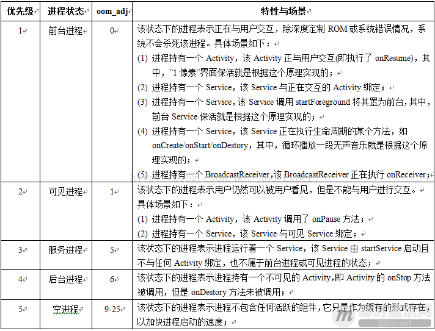

# Android6.0以上的保活实践-进程防杀

对于ANdroid6.0及其以上系统APP保活,主要还是通过两方面进行

- 降低oom_adj值,尽量保证进程不被系统杀死
- 进程被杀死后,通过其他方式将进程复活

先了解Android系统回收内存中的进程所依据的规则:

进程在内幕才能中活动主要有五种状态,前台进程,可见进程,服务进程,后台进程,空进程.

这几种状态的进程优先级由高到低,oom_adj的值由低到高.然后Android系统会根据当前系统资源和进程oom-adj值来回收相应的进程,前台进程一般不会被回收,空进程最容易被回收,这种管理规则就是传说中的low memory killer.



优先级1表示最高级,普通进程的oom_adj >= 0,系统进程的oom_adj < 0,系统会根据响应的内存阀值对符合某段oom_adj值的进程进行回收.另外,oom_adj值也会随着占用物理内存越大而增大,系统进程绝对不会被系统杀死.

## APp进程防杀方案原理

主流APP主要是通过监听锁屏,网络等系统广播,将进程置于前台以提高进程的级别,从而防止进程不那么轻易被系统干掉.

我们模拟一种场景:当用户登录测试APP后,先不开启保活功能;当用户开始跑步时,开启保活功能,然后再在这基础上做黑屏运行,一键清理,强制停止等功能.就是说Android项目中的SplashActivity,loginActivty只是配合我们演戏的,真正启动app保活逻辑的是在sportsActivity..

## APP进程防杀第一节:开启前台service

将service置位前台,目的是提高service的oom_adj值,降低其被系统回收的几率.该方案的原理是,通过startForeground方法将当前service置于前台来提高service的优先级.而对于API大于18而言,startForeground方法需要弹出一个可见通知,这里可以开启另一个service将通知栏移除,其oom-adj还是没变的

DaemonService.java

```java
/**
 * 前台service,使用startForeground
 * 这个service尽量要轻,不要占用过多的系统资源
 */
public class DaemonService extends Service{
    private static final String TAG = "DaemonService";
    public static final int NOTICE_ID = 111;
    
    public IBinder onBind(Intent intent){
        return null;
    }
    
    public void onCreate(){
        super.onCreate();
        Log.d(TAG,"DaemonService oncreate");
        if(Build.VERSION.SDK_INT >= Build.VERSION_CODES.JELLY_BEAN_MR2){
            Notification.Builder builder = new Notification.Builder(this);
            builder.setSmallIcon(R.mipmap.ic_launcher);
            builder.setContentTitle("KeepAlive");
            builder.setContentText("DaemonService is running");
            startForeground(NOTICE_ID,builder.build());
            
            Intent intent = new Intent(this,CancelNoticeService.class);
            startService(intent);
        }else{
            startForeground(NOTICE_ID,new Notification());
        }
    }
    
    public int onStartCommand(Intent intent,int flags,int startId){
        //如果service被终止
        //当资源允许情况下,重启service
        return START_STICKY;
    }
    
    public void onDestroy(){
        super.onDestroy();
        //如果service被杀死,干掉通知
        if(Build.VERSION.SDK_INT >= Build.VERSION_CODES.JELLY_BEAN_MR2){
            NotificationManager manager = getSystemService(NOTIFICATION_SERVICE);
            manager.cancel(NOTICE_ID);
        }
        Log.d(TAG,"DaemonService onDestroy");
        Intent intent = new Intent(getApplcation(),DaemonService.class);
        startService(intent);
    }
}

```

这里用了两个技巧:

- onStartCommand方法中返回START_STICKY,其作用是当service进程被kill后,系统会尝试重新创建这个service,且会保留service的状态为开始状态,但不保留传递的intent对象,onStartCommand方法一定会被重新调用
- onDestroy方法中从新启动自己,也就是说,只要service在被销毁时走到了onDestroy这里我们就重新启动它.

CancelNoticeService.java

```java
/**
 * 移除前台service通知栏标志,这个service选择使用
 */
public class CancelNoticeService extends Service{
    public IBinder onBind(Intent intent){
        retuen null;
    }
    
    public void onCreate(){
        super.onCreate();
    }
    
    public int onStartCommand(Intent intent,int flags,int startId){
        if(Build.VERSION.SDK_INT >= Build.VERSION_CODES.JELLY_BEAN_MR2){
            Notification.Builder builder = new Notification.Builder(this);
            builder.setSmallIcon(R,mipmap.ic_launcher);
            startForeground(DaemonService.NOTICE_ID,builder.build());
            //开启一条线程去移除DaemonService弹出的通知
            new Thread(new Runnable(){
                public void run(){
                    SystemClock.sleep(1000);
                    stopForeground(true);
                    NotificationManager manager = getSystemService(NOTIFICATINO_SERVICE);
                    manager.cancel(DaemonService.NOTICE_ID);
                    stopSelf();
                }
            }).start();
        }
        return super.onStartCommand(intent,flags,startId);
    }
    
    public void onDestroy(){
        super.onDestroy();
    }
}
```

AndroidManifest.xml

```java
<service android:name=".service.DaemonService"
         android:enabled="true"
         android:exported="true"
         android:process=":daemon_service"/>
<service android:name=".service.CancelNoticeService"
         android:enabled="true"
         android:exported="true"
         android:process=":service"/>
```

一个service没有自己独立的进程,他一般是作为一个线程运行于他所在的应用进程中,且应用进程名称与包名一致.如果希望指定的组件和应用运行在指定的进程中,就需要通过android:process属性来为其创建一个进程.因此,android:process=".daemon_service"就是让DaemonService运行在不同的进程中,android:enabled属性的作用是Android系统是否实例化应用程序中的组件,android:exported属性作用是当前组件service是否可以被包含本身以外的应用中的组件启动.

## APP进程防杀方案第二节:监听锁屏广播,制造1像素activity

ScreenManager.java

```java
/**
 * 1像素管理类
 */
public class ScreenManager{
    private static final String TAG = "ScreenManager";
    private Context context;
    private static ScreenManager screenManager;
    private WeakReference<Activity> activityRef;
    
    private ScreenManager(Context context){
        this.context = context;
    }
    
    public static ScreenManager getInstance(Context context){
        if(screenManager == null) {
            screenManager = new ScreenManager(context);
        }
        return screenManager;
    }
    
    public void getSingleActivty(Activity activity){
        activityRef = new WeakReference<>(activity);
    }
    
    public void startActivity(){
        Intent intent = new Intent(context,SinglePixelActivity.class);
        intent.setFlags(Intent.FLAG_ACTIVITY_NEW_TASK);
        context.startActivty(intent);
    }
    
    public void finishActivity(){
        if(activityRef != null){
            Activity activity = activityRef.get();
            if(activity != null){
                activity.finish();
            }
        }
    }
}
```

Java中为对象的引用分了四个级别,强引用,软引用,弱引用,虚引用.

SinglePixelActivity.java

```java
/**
 * 1像素activity
 */
public class SinglePixelActivity extends AppCompatActivity{
    private static final String TAG = "SinglePixelActivity";
    
    protected void onCreate(Bundle savedInstanceState){
        super.onCreate(savedInstanceState);
        Window window = getWindow();
        window.setGravity(Gravity.LEFT|Gravity.TOP);
        WindowManager.LayoutParams attrParams = window.getAttributes();
        attrParams.x = 0;
        attrParams.y = 0;
        attrParams.height = 1;
        attrParams.width = 1;
        window.setAttributes(attrParams);
        
        ScreenManager.getInstance(this).setSingleActivity(this);
    }
    
    protected void onDestroy(){
        if(!SystemUtils.isAppAlive(this,Contants.PACKAGE_NAME)){
            Intent intent = new Intent(this,SportsActivity.class);
            intent.setFlag(Intent.FLAG_ACTIVYT_NEW_TASK);
            startActivity(intent);
        }
        super.onDestroy();
    }
}
```

在ui界面架构中,每个activity都包含一个window对象,在android中window对象通常由phonewindow来实现,phonewindow将一个decorview设置为整个应用窗口的根view,他作为窗口界面的顶层视图,封装了很多通用操作窗口的方法,

SportsActivity.java

```java
/**
 * 运动界面,监听锁屏广播,判断开关1像素界面
 */
public class SportsActivity extends AppCompatActivity{
    private ScreenReceiverUtil screenListener;
    private ScreenManager screenManager;
    
    private ScreenReceiverUtil.ScreenStateListener screenListener = new ...{
        public void onScreenOn(){
            screenManager.finishActivity();
        }
        
        public void onScreenOff(){
            screenManager.startActivity();
        }
        
        public void onUserPresent(){
            
        }
    }
    
    protected void onCreate(){
        super.onCreate();
        setContentView();
        
        screenListener = new ScreenListener(this);
        screenManager = ScreenManager.getInstance(this);
        screenListener.setListener(screenListener);
    }
}
```

AndroidManifest.xml

```java
<activity android:name=".SportsActivity"
    	  android:launchMode="SingleTask"/>
<activity android:name=".SinglePixelActivity"
          android:configChanges="keyboardHidden|orientation|screenSize|navigation|keyboard"
          android:finishOnTaskLaunch="false"
          android:excludeFromRecents="true"
         android:launchMode="SingleInstance"
             android:theme="..."/>
```

