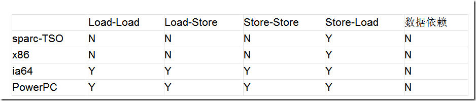

## 1.总线锁定和缓存一致性

这是两个操作系统层面的概念.随着多核时代的到来,并发操作已经成为了很常见的现象,操作系统必须要有一些机制和原语,以保证某些基本操作的原子性.首先处理器需要保证读一个字节或写一个字节是无条件原子的,不存在度/写了一半被中断的情况,但这还不够,在并发环境下,为了满足多线程的一致性,还必须提供更大范围原子性的操作,比如Compare And Swap操作.操作系统雨量中保证原子性的机制:总线锁定和缓存一致性.

我们知道,CPu和物理内存之间的通信速度远低于CPU的处理速度,所以cpu有自己的内部缓存,根据一些规则将内存中的数据读取到内部缓存中来,以加快频繁读取的速度.我们假设在一台PC上只有一个CPU和一份内部缓存,那么所有进程和线程看到的数据都是缓存里面的数据,不会存在问题;但现在服务器通常是多CPU,更普遍的是,每块CPU里有多个内核,而每个内核都维护了自己的缓存,那么这时候多线程并发就会存在缓存不一致性,这回导致严重的问题.

以i++为例,i的初始值为0,那么在开始每块缓存都存储了i的值0,当第一块内核做i++的时候,其缓存中的值变成了1,即时马上写回到主内存,那么在回写之后第二块内核缓存中的i值依然是0,其执行i++,会写到内存就会覆盖第一块内核的操作,使得最终的结果是1,而不是预期的2.

那么怎么解决这个问题?操作系统提供了总线锁定的机制.前端总线是所有CPU与芯片组连接的主干道,负责cpu与外界所有部件的通信,包括高速缓存,内存,北桥,其控制总线向各个部件发送控制信号,通过地址总线发送地址信号指定其要访问的部件,通过数据总线双向传输.在cpu1要做i++操作的时候,其在总线上发出一个LOCK#信号,其他处理器就不能操作缓存了该共享变量内存地址的缓存,也就是阻塞了其他CPU,使该处理器可以独享此共享内存.

但我们只需要对此共享变量的操作是原子就可以了,而总线锁定把CPU和内存的通信给锁住了,使得在锁定期间,其他cpu不能操作其他内存地址的数据,从而开销较大,所以后来的cpu都提供了缓存一致性机制.

- 缓存一致性机制:是当模块CPU对缓存中的数据进行操作之后,就通知其他cpu放弃存储在他们内部的缓存,或者从主内存中重新读取

Intel系列中广泛使用的MESI协议

MESI协议是以缓存行(缓存基本数据单位,在intel的cpu上一般是64字节)的几个状态来命名的(Modified,Exclusive,Share,Invalid).该协议要求在每个缓存行上维护两个状态位,使得每个数据单位可能处于M,E,S,I这四种状态之一.

- M:被修改的.处于这一状态的数据,只在本CPu中有缓存数据,其他cpu中没有.同时其状态相对于内存中的值来说,是已经被修改的,且没有更新到内存中
- E:独占的,处于这一状态的数据,只有在本cpu中有缓存,且其数据没有修改,即与内存中一致
- S:共享的.处于这一状态的数据在多个cpu中都有缓存,且与内存一致
- i:无效的,本cpu中这份缓存已经无效

该协议约定的缓存上对应的监听:

- 一个处于M状态的缓存行,必须监听所有视图读取该缓存行对应的主存地址的操作,如果监听到,则必须在此操作执行前把其缓存行中的数据写回cpu
- 一个处于s状态的缓存行,必须时刻监听使该缓存行无效或独享该缓存行的请求,如果监听到,则必须把其缓存状态设置为i
- 一个处于e状态的缓存行,必须时刻监听其他试图读取该缓存行对应的主存地址的操作,如果监听到,则必须把其缓存行状态设置为s

当cpu需要读取数据时,如果其缓存行的状态时i,则需要从内存读取,并把自己状态变成s,如果不是i,则可以直接读取缓存的值.但在此之前,必须等待其他cpu的监听结果,如果其他cpu也有该数据的缓存且状态时m,则需要等待其把缓存更新高内存之后再读取

当cpu需要写数据时,只有在其缓存行是m或者e的时候才能执行,否则需要发出特殊的RFO(read or Ownership),通知其他cpu置缓存无效i,这种情况下性能开销会很大,写入完成后,修改其缓存状态为m

## 2.CAS(Compare and Swap)

CAS指令在Intel CPU上成为CMPXCHG指令,它的作用是将制定内存地址的内容与所给的某个值相比,如果相等,则将其内容替换为指令中提供的新值,如果不相等,则更新失败.这一比较并交换的操作是原子性的,不可以被中断,而其保证原子性的原理就是"总线锁定和缓存一致性".

JDK5引入了CAS机制--比较并交换--来彻底解决synchronized开销大的问题,在一般情况下不再需要挂起,而是多次尝试,其利用底层CPU命令实现乐观锁机制.从内存领域来说这是乐观锁,因为它在对共享变量更新之前会先比较当前值是否与更新前的值一致,如果是则更新,如果不是则无线循环执行,直到当前值与更新前的值一致为止,才执行更新.

concurrent中的AtomicInteger代码

```java
public final int getAndIncrement(){
    for(;;){
        int current = get();
        int next = current + 1;
        if(compareAndSet(current,next)){
            return current;
        }
    }
}

public final boolean compareAndSet(int expert,int update){
    return unsafe.compareAndSwapInt(this,valueOffset,expert,update);
}
```

其调用了 compareAndSwap(expert,update),期望值即操作前的原始值,而update是操作后的值

```java
public native boolean compareAndSwapInt(Object obj,long offset,int expert,int update);
```

利用CAS保证其原子性,同时如果失败了则通过循环不断的运算知道成功为止,失败的线程不在被挂起,重新调度,而是可以无障碍再度运行,极大减少了挂起调度的开销.

CAS策略需要注意的事项:

- 在线程抢占资源特别频繁的时候,会造成长时间的自旋,耗费CPU性能
- 有ABA问题,这时当前线程认为是可以执行的,其实是发生了不一致现象,如果这种不一致对程序有影响,则需要使用AtomicStampedReference
- 只能对一个变量进行原子性操作.如果需要把多个变量作为一个整体来做原子性操作,则应该使用AtomicReference来把这些变量放在一个对象里,针对这个对象来做原子性操作

CAS在jdk5中被juc包广泛使用,在jdk6中被用在synchronized的jvm实现中,在jdk6中,两者效果相差无几,推荐使用synchronized.

## 3.内存屏障

一个线程是由一个cpu核来处理的,但现代cpu为了继续挖掘并行运算能力,出现了流水线技术,即每个内核有多个电路,调度器将串行指令分解为多步,将不同指令的各步操作结果叠加,从而实现并行处理,指令的每不都由各自独立的电路来处理,最后汇总处理.指令该如何分解,指令顺序,如何保证结果正确?

重排序



Load指的是从内存中读取数据的操作,即if(a<1)这样的语句(只读不写);

Store指的是向内存中写入数据的操作,即a=10这样的语句(只写不读)

Load-load值先读后读的操作是否允许重排序

load-store指先读后写是否允许重排序

store-store值先写后写是否允许重排序

store-load先写后读是否允许重排序

只支持store-load重排序,因为cpu在写入的时候是首先寄存器,包括各级缓存,此时并没有刷新到内存中,如果等待其完成再读则太慢了,允许重排序.