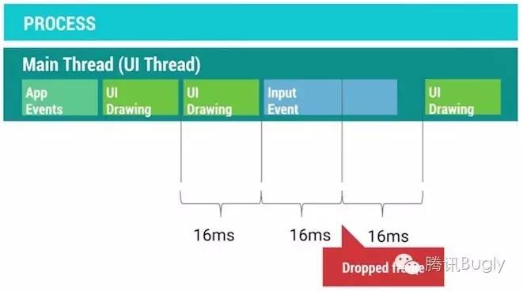

# 性能优化--多线程

https://www.cnblogs.com/bugly/p/5519510.html

## 1.Threading Performance

在程序开发中,为了让程序表现的更加流畅,我们肯定会需要使用多线程来提升程序的并发执行能力.但是多线程一直都是一个相对棘手的问题,所以想要获得更佳的新更能,我们非常又要掌握多线程并发编程的基础技能.

Android程序的大多数代码操作都必须执行在主线程,如系统事件(屏幕旋转),输入事件(点击,滑动),程序回调服务,UI绘制以及闹钟事件等等.那么我们在上述事件或方法中插入的代码也将执行在主线程.


一旦我们在主线程里面添加了操作复杂的代码,这些代码就可能阻碍主线程去响应点击/滑动事件,阻碍主线程的ui绘制等等.我们知道为了让屏幕刷新的帧率达到60fps,我们需要确保16ms内完成单次刷新的操作.一旦我们在主线程里面执行的任务过于繁重就可能导致接收到刷新信号的时候因为资源被占用而无法完成这次刷新操作.就会产生掉帧的现象,刷新帧率就自然跟着下降了,(一旦帧率掉到20fps,用户就可以明显感觉到卡顿)



为了避免上述问题,我们需要使用多线程的技术方案,把那些操作复杂的任务移动到其他线程当中执行,这样就不容易阻塞主线程,也就减小了出现掉帧的可能性.


那么问题来了,为主线程减轻负担的多线程方案有那些呢?这些方案分别适合在什么场景下使用?

- AsyncTask:为UI线程与工作线程之间进行快速切换提供一种简单便捷的机制.适用当下立即需要启动,但是异步执行的生命周期短暂的使用场景
- HandlerThread:为某些回调方法或者等待某些任务的执行设置一个专属的线程,并提供线程任务的调度机制
- ThreadPool:把任务分解成不同单元,分发到各个不同的线程上,进行同时并发处理
- IntentService:适合于执行由UI触发的后台Service任务,并可以把后台任务执行的情况通过一定的机制反馈给UI

了解这些系统提供的多线程工具类分别适合在什么场景下,可以帮助我们选择合适的方案,避免出现不可预期的麻烦..虽然使用多线程可以提高程序的并发量,但是我们需要特别注意的是,因为引入多线程可能伴随而来的内存问题.比如,在Activity内部定义一个AsyncTask,他属于一个内部类,该类本身和外面的Activity是有引用关系的,如果Activity要销毁的时候,AsyncTask还在运行,这回导致Activity没有办法完全释放,从而引发内存泄漏.

所以说,多线程是提升程序性能的有效手段之一,但是使用多线程却需要十分谨慎小心,如果不了解背后的执行机制以及使用的注意事项,很可能引起严重的问题.

## 2.Understanding Android Threading

一个线程需要经历三个生命阶段,开始,执行,结束.线程会在任务执行完毕之后结束.那么为了确保线程的存活,我们会在执行阶段给线程赋予不同的任务.然后在里面添加退出的条件,确保任务能够执行完毕后退出


在很多时候,线程不仅仅是线性执行一系列任务就结束这么简单的,我们会需要增加一个任务队列,让线程不断的从任务队列中获取任务去进行执行,另外我们还可能在线程执行的任务过程中与其他的线程进行协作.如果这些细节都交给我们来处理,这将会是件及其繁琐又容易出错的事情.


Android系统为我们提供了Looper,Handler,MessageQueue来帮助实现上面的线程任务模型:

- Looper:能够确保线程持续存活并且可以不断的从任务队列中获取任务并进行执行
- Handler:能够帮助实现队列任务的管理,不仅仅能够把任务插入到队列的头部,尾部,还可以按照一定的时间延迟来确保任务从队列中能够来得及被取消掉
- MessageQueue:使用Intent,Message,Runnable作为任务的载体在不同的线程之间进行传递.

把上面三个组件打包到一起进行写作,这就是HandlerThread

我们知道,当程序被启动,系统会帮忙创建进行以及相应的主线程,而这个主线程就是一个HandlerThread,这个主线程会需要处理系统事件,输入事件,系统回调的任务,UI绘制等等任务,为了避免主线程任务过重,我们就会需要不断的开启新的工作线程来处理那些子任务.

## 3.Memory & Threading

增加并发的线程数会导致内存消耗的增加,平衡好这两者关系是非常重要的.我们知道,多线程并发访问同一块内存区域有可能带来很多问题,例如读写的权限争夺问题,ABA问题.为了解决这些问题,我们会需要引入锁的概念.

在Android系统中也无法避免因为多线程的引入而导致出现诸如上文中提到的各种问题.Android UI对象的创建,更新,销毁等等操作都默认是执行在主线程,但是如果我们在非主线程对UI对象进行操作,程序将可能出现异常甚至崩溃.

另外,在非UI线程中直接持有UI对象的引用也可能出现问题,例如work线程中持有某个ui对象的引用,在work线程执行完毕之前,ui对象在主线程中被ViewHierarchy中移除了,这个时候UI对象的任何属性都已经不再可用了,另外对这个UI对象的更新操作也没有任何意义了,因为它已经从ViewHierarchy中被移除,不再绘制到画面上了.

不仅如此,View对象本身对所属的Activity是有引用关系的,如果工作线程持续保有View的引用,这就可能导致Activity无法完全释放.除了直接显示的引用关系可能导致内存泄漏外,我们还需要特别留意隐式的引用关系也可能导致泄漏.例如我们会看到在Activity里面定义的一个AsyncTask,这种类型的AsyncTask与外部的Activity是存在隐式引用关系的,只要Task没有结束,引用关系就会一直存在,这很容易导致Activity的泄漏.更糟糕的情况是,它不仅仅发生了内存泄漏,还可能导致程序异常或者崩溃.

```java
public class MyActivity extends Activity{
    public class MyAsyncTask extends AsyncTask<...>{
        @Override
        protected ... doInBackground(...){}
        
        @Override
        protected void onPostExecute(...){}
    }
}
```

为了解决上面的问题,我们需要谨记的原则就是:不要在任何非UI线程里面去持有UI对象的引用.系统为了确保所有的UI对象都只会被UI线程所进行创建,更新,销毁的操作,特地设计了对应的工作机制(当Activity被销毁的时候,由该Activity所触发的非UI线程都将无法对UI对象进行操作,否则就会抛出程序执行异常的错误)来防止UI对象被错误的使用.

## 4.Good AsyncTask Hunting

AsyncTask是一个让人既爱又恨的组件,他提供了一种简便的异步处理机制,但是他又同时引入了一些麻烦,一旦对AsyncTask使用不当,很可能对程序的性能带来负面影响,同时还可能导致内存泄漏

比如:用户切换到某个界面,触发界面图片加载,因为图片加载相对耗时,我们需要在子线程中处理图片加载,当图片在子线程处理完后,再把处理好的图片返回给主线程,交给UI更新到画面.

AsyncTask的出现就是为了快速的实现上面的使用场景,AsyncTask把在主线程里面的准备工作放到`onPreExecute()`方法里面执行,`doInBackground()`方法执行在工作线程中,用来处理那些繁琐的任务,一旦任务执行完毕,就会调用`onPostExecute()`方法返回到主线程

使用AsyncTask需要注意的问题有那些呢

- 首先,默认情况下,所有的AsyncTask任务都是被线性调度执行的,他们都处在同一个任务队列当中,按顺序逐个执行.假设你按照顺序启动20个AsyncTask,一旦其中某个AsyncTask执行时间过长,队列中的其他剩余AsyncTask都处于阻塞状态,必须等到该任务执行完毕之后才能有机会执行下一个任务

  为了解决上面提到的线性队列等待的问题,我们可以使用`AsyncTask.executeOnExecutor()`强制执行AsyncTask使用线程池并发调度任务.

- 其次,如何才能真正取消一个AsyncTask的执行呢?我们知道AsyncTask有提供`cancel()`方法,但是这个方法实际上做了什么事情呢?线程本身并布局诶中止正在执行的代码的能力,为了能够让一个线程更早的被销毁,我们需要在`doInBackground()`的代码中不断的添加程序是否被中止的判断逻辑,

  ```java
  DoInBackground(){
      If(isCancelled()){
          
          For(i < objs.length){
              If(isCancelled()){
                  
              }
          }
          
      }
  }
  ```

  一旦任务被中止,AsyncTask就不会继续调用`onPostExecute()`,而是通过调用`onCancelled()`的回调方法反馈任务执行取消的结果.我们可以根据任务回调到哪个方法,(onPostExecute还是oncancelled)来决定是对UI进行正常的更新还是把对应的任务所占用的内存进行销毁等.

- 最后,使用AsyncTask很容易导致内存泄漏,一旦把AsyncTask写成Activity的内部类的形式就很容易因为AsyncTask生命周期的不确定而导致Activity发生泄漏.

  ```java
  public class MainActivity extends Activity{
      public class MyAsyncTask extends AsyncTask<>{
          @Override
          protected String doInBackground(){}
          
          @Override
          protected void onPostExecute(){}
      }
  }
  ```

## 5.Getting a HndlerThread

大多数情况下,AsyncTask都能够满足多线程并发的场景需要(在工作线程执行任务并返回结果到主线程),但是它并不是万能的.例如打开相机之后的预览帧数据是通过`onPreviewFrame`方法回调的,`onPreviewFrame`和`open`相机的方法是执行在同一个线程的


如果这个回调方法执行在UI线程,那么在onPreviewFrame里面将要执行的数据转换操作江河主线程的界面绘制,事件传递等操作争抢系统资源,这就有可能影响到主界面的表现性能.


我们需要确保onPreviewFrame执行在工作线程,如果使用AsyncTask,会因为AsyncTask默认的线性执行的特性会导致因为无法把任务及时传递给工作线程而导致任务在主线程中被延迟,直到工作线程空闲,才可以吧任务切换到工作线程中进行执行.


所以我们需要的是一个执行在工作线程,同时又能够处理队列中的复杂任务的功能,而HandlerThread的出现就是为了实现这个功能的,他组合了Handler,MessageQueue,Looper实现了一个长时间运行的线程,不断的从队列中获取任务进行执行的功能.


回到刚刚处理相机回调数据的例子,使用HandlerThread我们可以把open操作与onPreviewFrame的操作执行在同一个线程,同时还避免了AsyncTask的弊端,如果需要在onPreviewFrame里面更新UI,只需要调用runonuithread方法吧任务回调给主线程就够了.

HandlerThread比较合适处理那些在工作线程执行,需要花费时间偏长的任务.我们只需要把任务发送给HandlerThread.然后就只需要等待任务执行结束的时候通知返回到主线程就好了.

另外,一旦我们使用了HandlerTHread,需要特别注意给HandlerTHread设置不同的线程优先级,CPU会根据设置的不同线程优先级对所有的线程进行调度优化

## 6.Swimming in ThreadPools

线程池适合用在把任务进行分解,并发进行执行的场景.通常来说,系统里面会针对不同的任务设置一个单独的守护线程用来专门处理这项任务.例如使用NetWorkingTHread来专门处理网络请求的操作,使用IO Thread来转man处理系统IO操作,针对那些场景,这样设计是没有问题的,因为对应的单次执行的时间并不长而且可以顺序执行.但是这种专属的单线程并不能满足所有的情况,例如我们要一次性decode40张图片,每个线程需要执行4ms时间,如果我们使用单线程方案,需要花费160ms,如果开启10个线程,则只需要16ms就能够处理完毕

为了能够实现上面的线程池模型,系统提供了ThreadPoolExecutor帮助类来简化实现.剩下需要做的就只是对任务进行分解就好了

使用线程池需要特别注意的是,同时并发线程数量的控制,理论上说,我们可设置任意你想要的并发数量,但是因为CPU只能同时执行固定数量的线程数,一旦同时并发的线程数超过CPU能够同时执行的阀值,CPU就需要花费精力来判断哪些线程的优先级比较高,需要在不同的线程之间进行调度切换.

一旦同时并发的线程数量达到一定的量级,这个时候CPU在不同线程之间进行调度的时间就可能过长,反而导致性能严重下降.

每开一个线程,都会耗费至少64k+内存,为了能够方便的对线程数量进行控制,ThreadPoolExecutor为我们提供了初始化的并发线程数量,以及最大的并发数量进行设置

```java
private static int NUMBER_OF_CORES = Runtime.getRuntime().avaliableProcessors();

mDecodeThreadPool = new ThreadPoolExecutor(
			NUMBER_OF_CORES >> 1,
    		NUMBER_OF_CORES,
    		KEEP_ALIVE_TIME,
    		KEEP_ALIVE_TIME_UNIT,
    		mDecodeWorkQueue);
```

- Runtime.getRuntime().avaliableProcessor()方法并不可靠,他返回的值并不是真实的CPU核心数,因为CPU会在某些情况下选择对部分核心进行睡眠处理,这时返回的数量就只是激活的CPU核心数

## 7.The Zen of IntentService

默认的service是在主线程执行的,可是通常情况下,这很容易影响到程序的绘制性能(抢占了主线程的资源).我们可以使用IntentService来实现异步操作.IntentService继承自普通的Service同时又在内部创建了一个HandlerThread,在onHandlerIntent的回调里面处理扔到IntentService的任务,所以IntentService不仅仅具备了异步线程的特性,还同时保留了service不受主页面生命周期影响的特点.

如此,我们可以在IntentService里面通过设置闹钟间隔性的触发异步任务,例如刷新数据,更新缓存的图片或者是分析用户操作行为等等.

- 首先,因为IntentService内置的是HanlderThread作为异步线程,所以每一个交给IntentSErvice的任务都将以队列的方式逐个被执行,一旦队列中有某个任务执行时间过长,那么就会导致后续的任务都会被延迟处理
- 其次,通常使用到IntentService的时候,我们会结合使用BroadcastReceiver把工作线程的任务执行结果返回给主UI线程,使用广播容易引起性能问题,我们可以使用LocalBroadcastManager来发送只在程序内部传递的广播,从而提升广播的性能,我们也可以使用runonuithread快速回调到主ui线程
- 最后包含正在运行的intentservice的程序相比起纯粹的后台程序更不容易被系统杀死,改程序的优先级是介于前台程序和纯后台程序之间的.

## 8.Threading and Loaders

当启动工作线程的activity被销毁时,为了方便控制工作线程的启动与结束,Android为我们引入了Loader来解决这个问题,我们知道Activity有可能因为用户的主动切换而频繁的被创建销毁,也有可能是因为类似屏幕发生旋转等被动原因而销毁再重建.在Activity不停的创建和销毁过程当中,有可能因为工作线程持有Activity的View而导致内存泄漏(因为工作线程持有View的强引用,另外工作线程的生命周期无法保证和activity的生命周期一致,这就容易引发内存泄漏).除了可能引起内存泄漏之外,在activity被销毁之后,工作线程还继续更新视图是没有意义的,

Loader的出现就是为了确保工作线程能够和Activity的生命周期保持一致,同时避免出现前面提到的问题

LoaderManager会对查询的操作进行缓存,只要对应cursor上的数据源没有发生变化,在配置信息发生变动的时候,loader可以直接把缓存的数据回调到onloadfinished,从而避免重新查询数据,另外系统会在loader不在需要使用到的时候回调onloaderreset方法,我们可以在这里做数据的清除等操作

咋actiivty或者fragment中使用loader可以方便的实现异步加载的框架,loader有诸多优点.但是实现loader的这套代码很复杂

## 9.The Important of Thread priority

理论上说,我们的程序可以创建出非常多的子线程一起并发执行,可是基于CPu时间片轮转调度的机制,不可能所有的线程都可以同时被调度执行,CPU需要根据线程的优先级赋予不同的时间片.

Andorid会根据当前运行的可见的程序和不可见的后台程序对线程进行归类,前台会占用CPU90%左右的时间片,后台就只能分享5-10%左右的时间片.

默认情况下,新创建的线程的优先级和创建它的母线程保持一致,如果主UI线程创建了几十个工作线程,这些工作线程的优先级默认和主线程保持一致了.为了不让新创建的工作线程和主线程抢占CPU资源,需要把这些线程的优先级进行降低处理,这样才能给帮助CPU识别主次,提高主线程所能得到的系统资源.

在Android系统里,我们可以通过设置android.os.Process.setThreadPriority(int)设置线程的优先级,参数范围从-20到19,数值越小优先级越高.android系统为我们提供了一下预设值,我们可以通过给不同的工作线程设置不同的优先级来达到更细粒度的控制


大多数情况下,新创建的线程优先级是默认0,主线程设置为0的时候,新创建的线程还可以利用THREAD_PRIORITY_LESS_FAVORABLE或者THREAD_PRIORITY_MORE_FAVORABLE来控制优先级


Android系统里面AsyncTask和IntentService已经默认帮我们设置了线程优先级,但对于非官方的多线程工具类,我们需要特别留意根据需要来手动设置优先级

## 10.Profile GPU Rendering : M Update

从Android M开始,系统更新了GPU Prifiling工具来帮助我们定位UI的渲染性能问题.

- Sync & Upload:通常表示的是准备当前界面上有待绘制的图片所耗费的时间,为了减少该段区域的执行时间,我们可以减少屏幕上的图片数量或者是缩小图片本身的大小
- Measure & Layout:表示布局的onMeasure与onLayout所花费的时间,一旦时间过长,就要自己检查布局是不是存在严重的性能问题
- Animation:表示计算执行动画所需要花费的时间,包含ObjectAnimator,ViewPropertyAnimator,Transition等等,一旦执行时间过长,就需要检查是不是使用了非官方的动画工具或是检查动画执行过程是不是触发了读写操作等
- Input Handing:表示系统处理输入事件所耗费的时间,粗略等于对于事件处理方法所执行的时间,一旦执行时间过长,意味着在处理用户输入事件的地方进行了复杂的操作
- Misc/Vsync Delay:log上打印 Skipped XXX frames!The application may be doing too much work on its main thread.这意味着我们在主线程执行了太多的任务,导致UI渲染跟不上vSync的信号而出现掉帧的情况
- 

