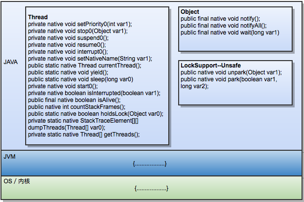
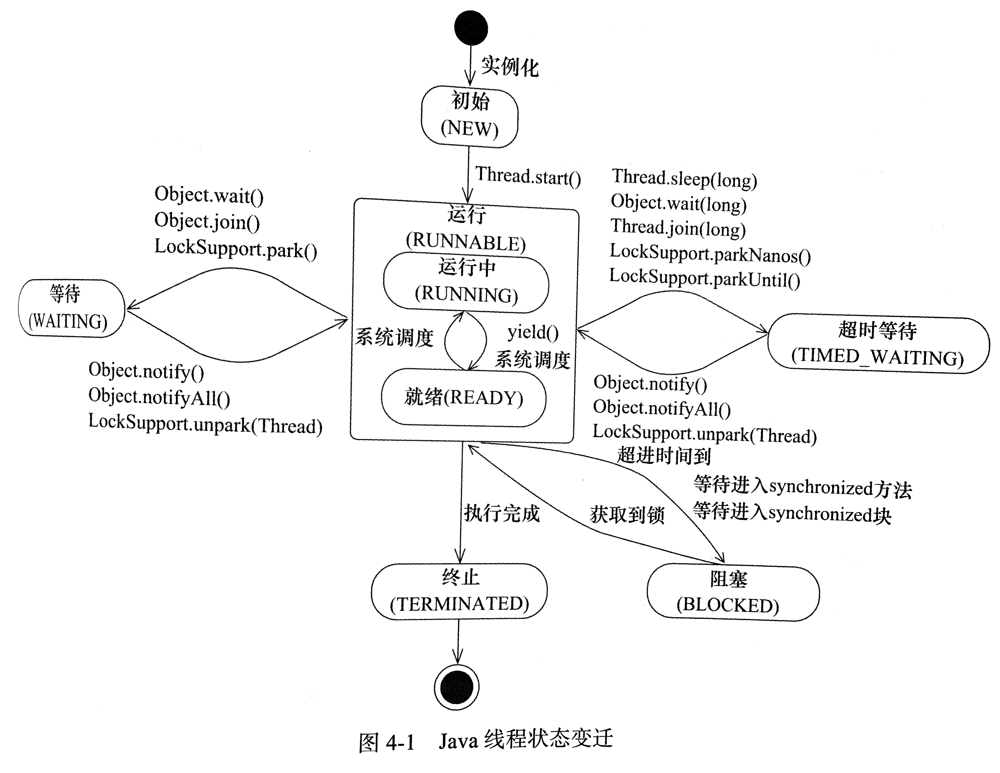

https://my.oschina.net/greki/blog/983729

## 1.线程基本概念

java线程要从java-jvm-内核,三个层面去理解相关逻辑



### 1.1进程和线程

### 1.2JVM线程调度

### 1.3线程状态

```java
public enum State{
    NEW,
    RUNNABLE,
    BLOCKED,
    WAITING,
    TIME_WAITING,
    TERMINATED;
}
```



说明:

- NEW状态指线程刚创建
- RUNNABLE线程正在正常运行中,
- BLOCKED受阻塞并等待监视器锁.
- WAITING无限期等待
- TIME_WAITING有时限等待
- TERMINATED死亡

理解

- block:blocked是指线程正在等待获取锁;waiting是指线程正在等待其他线程发来的notify,收到通知后,可能会顺序向后执行,也可能会再次获取锁,进而被阻塞住

- waiting:

  - 当wait被执行,锁被自动释放,当执行完notify方法,锁不自动释放

  - wait立刻释放synchronized(obj)中的obj锁,以便其他线程可以执行obj.notify,但是notify不会立刻释放obj锁,必须要等notify所在线程执行完synchronized(obj)块所有代码才会释放

  - wait()进入阻塞,就会释放当前锁,不然notify的时候也要持有同一把锁.

    wait意思就是放弃已经持有的锁然后等待

### 1.4线程状态和jstack输出

### 1.5线程内存模型

### 1.6线程切换

### 1.7线程安全

### 1.8线程优先级

## 2 线程的源码

### 2.1ThreadLocal

- 该类提供了线程局部变量
- 这些变量不同于他们的普通对应物,因为访问某个变量的每个线程都有自己的局部变量,他独立于变量的初始化副本
- ThreadLocal实例通常是类中的private static字段,他们希望将状态与某一个线程相关联

