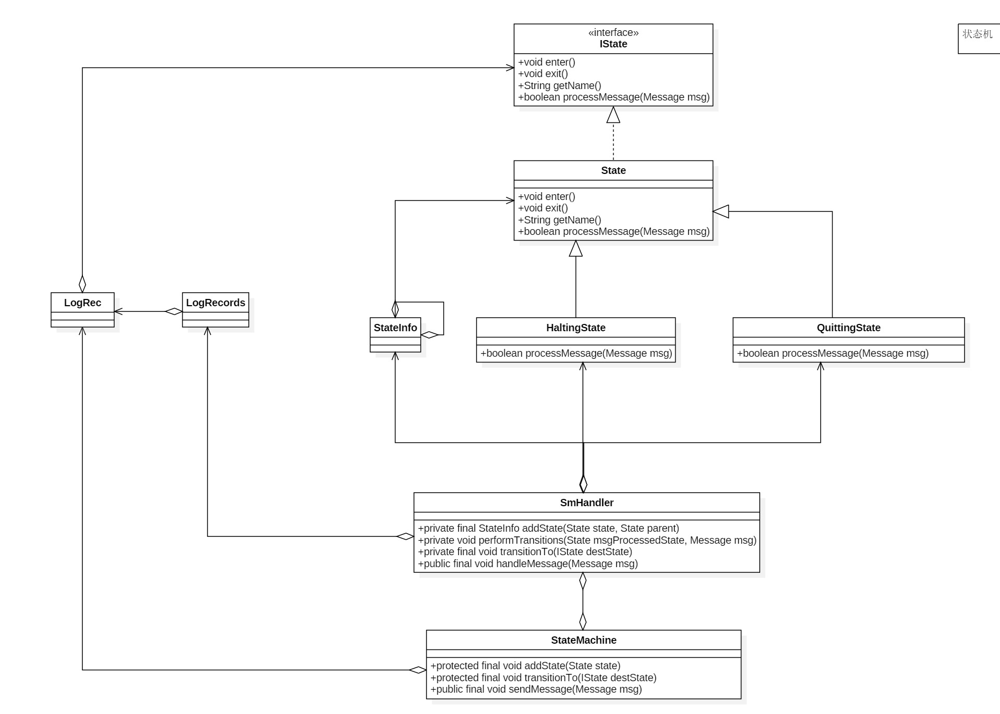

https://www.jianshu.com/p/1af9646a4e2d

# Android 状态机

## 概念

有限状态机，FSM，简称状态机，表示有限个状态以及在这些状态之间的转移和动作等行为的数学模型.

状态机可以描述为一个有向图树,有一组节点和一组转移函数组成.状态机通过相应一些列事件运行.每个事件都属于当前节点的转移函数的控制范围内,其中函数的范围是一个节点的子集.函数返回下一个节点.这些节点至少有一个终态,到达终态,状态机停止.

## Android StateMachine

Android 系统使用状态机处理不同的状态,可以避免分支语句导致的程序阅读性差以及扩展问题.



- IState:状态接口,每个状态必须实现的接口
  - void enter:状态进入时调用
  - void exit:状态退出时调用
  - boolean processMessage(Message msg):消息处理函数
- State:默认实现的IState接口的状态,需要实现新的状态时,一般只需要继承State重写里面的方法即可
- StateInfo:状态节点信息,类似链表节点
- StateMachine:定义状态层次关系以及状态转换.根据实际需求继承StateMachine,实现自己的状态管理

> 状态机重点是SmHandler类

## StateMachine

StateMachine有3个构造函数

```java
protected StateMachine(String name){
    mSmThread = new HandlerThread(name);
    mSmThread.start();
    Looper looper = mSmThread.getLooper();
    
    initStateMachine(name,looper);
}

protected StateMachine(String name,Handler handler){
    initStateMachine(name,handler.getLooper());
}

protected StateMachine(String name,Looper looper){
    initStateMachine(name,looper);
}

private void initStateMachine(String name,Looper looper){
    mName = name;
    mSmHandler = new SmHandler(looper,this);
}
```

常用的为 protected StateMachine(String name)方法创建一个状态机

mSmThread为HandlerThread,作为消息循环线程

mSmHandler我Handler用来处理消息


在状态机维护一个状态或者状态层次关系时,每个状态的节点信息存储在StateInfo中

### StateInfo 节点信息

```java
private class StateInfo{
    State state;
    
    StateInfo parentStateInfo;
    
    boolean active;
    
    public Stirng toString(){
        return "state=" + state.getName() +",active=" + active=",parent="
            +((parentStateInfo == null)?"null":parentStateInfo.state.getName());
    }
}
```

与链表的区别是,链表中存储的下一个子节点的信息,在状态树节点中存储的不是子节点而是父节点信息.优点便于迅速查找父节点,当该节点无法处理此消息时,可以直接传给父节点

### 状态机的构建

```java
protected final void addState(State state){
    mSmHandler.addState(state,null);
}
```

状态机构建使用addState()方法,addState调用mSmHandler.addState方法完成整个构建过程,

```java
private final StateInfo addState(State state,State parent){
    StateInfo parentStateInfo = null;
    if(parent != null){
        parentStateInfo = mStateInfo.get(parent);
        //存在父节点,但不在状态树中,添加进来
        if(parentStateInfo == null){
            //此处递归调用
            parentStateInfo = addState(parent,null);
        }
    }
    //状态不在状态树中,添加进来
    StateInfo stateInfo = mStateInfo.get(state);
    if(stateInfo == null){
        //将新state包装成StateInfo,存放在map中
        stateInfo = new StateInfo();
        mSateInfo.put(state,stateInfo);
    }
    
    //每个状态只能有一个父状态
    if((stateInfo.parentStateInfo != null)
       &&(stateInfo.parentStateInfo != parentStateInfo)){
        throw new RuntimeException("state already added");
    }
    
    stateInfo.state = state;
    stateInfo.parentStateInfo = parentStateInfo;
    stateInfo.acive = false;
    
    return stateInfo;
    
}
```

addState方法将每个新添加进来的状态封装成StateInfo,添加进状态树中,如果该状态的父节点不在状态树中,递归调用addState添加进状态树中

StateInfo存储父节点信息,这样可以通过StateInfo将每个节点联系在一起,状态机中所有节点都存储在HashMap<State,StateInfo>的键值对中

> 每个状态只能有一个父节点

### 状态机启动

```java
public void start(){
    SmHandler smh = mSmHanlder;
    if(smh == null) return;
    
    smh.completeConstruction();
}
```

start调用smh.completeContruction完成状态机构建

```java
private final void completeConstruction(){
	//计算状态机的深度,用于创建状态数容量
    //状态数记录某个节点到根节点的状态路径,长度不会超过maxDepth
    int maxDepth = 0;
    for(StateInfo si:mStateInfo.values()){
        int depth = 0;
        for(StateInfo i=si;i!=null;depth++){
            i = i.parentStateInfo;
        }
        if(maxDepth < depth){
            maxDepth = depth;
        }
    }
 	
    //根据状态栈的最大节点数,创建mStateStack,mTempStateStack状态栈
    mStateStack = new StateInfo[maxDepth];
    mTempStateStack = new StateInfo[maxDepth];
    //将状态路径存入状态栈
    setupInitialStateStack();
    
    //状态栈中存储当前节点到根节点的所有状态,根节点位于mStateStack的0位置
    
    //开启状态树:通过发送SM_INIT_CMD消息,通知状态树可以工作,异步调用enter方法
    sendMessageAtFrontOfQueue(obtainMessage(SM_INIT_CMD,mSmHandlerObj));
    
}
```

主要工作,

- 遍历状态树中的节点,获取树的最大节点数maxDepth
- 使用栈来记录某个节点到根节点的状态路径,路径不超过maxDepth
- 根据当前节点和树的最大节点数,调用setupInitialStateStack创建两个状态站
- 初始化完毕,发送SM_INIT_CMD消息,表示状态树构建完成


setupInitialStateStack填充栈数据

```java
private final void setupInitialStateStack(){
    //根据第一个初始状态
    StateInfo curStateInfo = mStateInfo.get(mInitialState);
    for(mTempStateStackCount = 0;curStateInfo != null;mTempStateStackCount++){
        mTempStateStack[mTempStateStackCount] = curStateInfo;
        curStateInfo = curStateInfo.parentStateInfo;
    }
    
    //循环完毕,根节点位于栈顶,初始节点位于栈底
    //清空mStateStack
    mStateStackTopIndex = -1;
    //将tmp Stack中数据反序填充到state stack中
    //这是根节点位于栈底index = 0;当前节点位于栈顶
    moveTempStateStackToStateStack();
}
```

根据当前节点,遍历所有父节点,将当前节点到根节点的信息存储在mTempStateStack中,循环过后当前节点位于栈底,根节点位于栈顶,调用moveTempStateStackToStateStack将mTempStateStack中树翻转存储到mStateStack中

moveTempStateStackToStateStack

```java
private final int moveTempStateStackToStateStack(){
    //startingIndex表示mStateStack接收新状态的起始位置
    //不是每次都从0开始
    int startingIndex = mStateStackTopIndex +1;
    //mTempStateStack个数
    int i = mTempStateStackCount -1;
    int j = startingIndex;
    while(i >= 0){
        mStateStack[j] = mTempStateStack[i];
        j+=1;
        i-=1;
    }
    
    //invokeEnterMethods 
    //新状态栈位置mStateStackTopIndex
    mStateStackTopIndex = j-1;
    
    return startingIndex;
}
```

当状态处理完毕,发送SM_INIT_CMD,SmHandler从消息队列中取出消息,完成状态机初始化工作.

```java
if(!mIsContructionCompleted && (mMsg.what == SM_INIT_CMD)
  	&& (mMsg.obj == mSmHandlerObj)){
    //根据SM_INIT_CMD消息表明构建任务完成,设置完成标志,开始处理消息
    mIsConstructionCompleted = true;
    //循环调用mStateStack中enter方法并将状态设置为激活状态
    invokeEnterMethods(0);
}
```

将mIsContructionCompleted标记变量设置为true,表示完成初始化,调用invokeEnterMethods,将每个状态设为激活状态,并调用enter方法

```java
private final void invokeEnterMethods(int stateStackEnteringIndex){
    for(int i = stateStackEnteringIndex;i <= mStateStackTopIndex; i ++){
        mStateStack[i].state.enter();
        mStateStack[i].active = true;
    }
    //enter方法是进入状态的必要工作,enter方法执行完,对应状态开始进行消息处理processMsg
}
```

### 状态处理

```java
public final void handleMessage(Message msg){
    if(!mHasQuit){
        mMsg = msg;
        
        State msgProcessedState = null;
        if(mIsContructionCompleted){
            //构建完成,开始处理状态
            msgProcessState = processMsg(msg);
            //处理完成msgProcessState,处理完了这个Message之后,将切换到哪个State
        }else if(!mIsContructionCompleted && (mMsg.what == SM_INIT_CMD)
                && (mMsg.obj== mSmHandlerObj)){
            //根据SM_INIT_CMD消息表明构建任务完成,设置完成标记
            mIsContructioncompleted = true;
            invokeEnterMethods(0);
        }else{
            throw new RuntimeException("Statemachine handlemessage:"+
                                      "the start method not called,received msg:" + msg);
        }
        
        performTransition(msgProcessedState,msg);
    }
}
```

状态机构建完成,调用processMsg()处理该状态,状态处理完毕,调用performTransition完成状态树的更新 

```java
private final State processMsg(Message msg){
    StateInfo curStateInfo = mStateStack[mStateStackTopIndex];
    if(isQuit(msg)){
        //SM_QUIT_CMD消息,切换到mQuittingState
        transitionTo(mQuittingState);
    }else{
        while(!curStateInfo.state.processMessage(msg)){
            //没有处理调用父状态处理
            curStateInfo = curStateInfo.parentStateInfo;
            if(curStateInfo == null){
                mSm.unhandledMessage(msg);
                break;
            }
        }
    }
    
    //返回最后成功处理了Message的那个状态,如果没有,那么就是返回null
    return (curStateInfo != null) ? curStateInfo.state:null;
}
```

- 如果接受到的是SM_QUIT_CMD消息,切换到mQuittingState状态,退出状态机
- 调用当前状态处理,如果当前状态没有处理,调用父状态处理
- 如果所有状态都不处理该消息,调用mSm.unhandleMessage

### 状态树切换

```java
protected final void transitionTo(IState destState){
    mSmHandler.transitionTo(destState);
}

private void performTransition(State msgProcessState,Message msg){
    State orgState = mStateStack[mStateStackTopIndex].state;
    
    //mDestState,具体状态调用transitionTo(State)时传入的参数
    //具体的状态在重写processMessage时,调用transitionTo(state)方法,设置下一步要切换的状态
    State destState = mDestState;
    if(destState != null){
        while(true){
            //获取从destState到还没有active的父节点
            //mTempStateStack存储是新的终止节点和旧终止节点的公共节点与新的
            //终止节点的一段状态树
            StateInfo commonStateInfo = setupTempStateStackWithStatesToEnter(destState);
            invokeExitMethods(commonStateInfo);
            
            //stateStackEnteringIndex 需要调用enter方法的状态在mStateStack中位置
            int stateStackEnteringIndex = moveTempStateStackToStateStack();
            
            //从stateStackEnteringIndex 位置开始调用enter方法的状态在mStateStack中位置
            invokeEnterMethods(stateStackEnteringIndex);
            
            //转换新状态后,将之前的延迟消息移动到消息队列的头部,使得延迟消息的处理早于其他消息
            moveDeferredMessageAtFrontOfQueue();
            
            if(destState != mDestState){
                destState = mDestState;
            }else{
                break;
            }
            mDestState = null;
        }
        
        if(destState != null){
            if(destState == mQuittingState){
                mSm.onQutting();
                cleanupAfterQuitting();
            }else if(destState == mHaltingState){
                mSm.onHalting();
            }
        }
    }
}
```

- 调用transitionTo转换状态,在调用mSmHandler.transitionTo设置目的状态,当消息处理完毕后便调用performTransition做真正的状态调整,主要是调整状态站的节点信息
- 根据新的目的节点,调用setupTempStateStackWithStatesToEnter(),查找到根节点没有被激活的状态,这些节点存储在mTempStateStack中,并得到新目的节点和旧目的节点的公共节点commonStateInfo
- 根据commonStateInfo,调用invokeExitMethods(),将需要移除栈的节点的状态设为false.并调用exit方法
- 调用moveTempStateStackToStateStack将mTempStateStack节点反转存储到mStateStack中,这样当前目的节点位于栈顶,下次处理消息时直接调用当前设置的目的节点
- 调用invokeEnterMethods方法,将新添加的节点状态设为true,并调用enter方法
- 在切换状态后,如果存在消息没有处理,调用moveDeferredMessageAtFrontOfQueue将延迟消息存放在消息队列的头部

### 状态机的退出

```java
protected final void quit(){
    SmHandler smh = mSmHandler;
    if(smh == null) return;
    
    smg.quit();
}
```

调用SmHandler的quit

```java
private final void quit(){
    sendMessage(obtainMessage(SM_QUIT_CMD,mSmHandlerObj));
}
```

processMsg处理消息时判断是退出消息,调用transitionTo(mQuittingState),切换到QuittingState状态,做状态机退出工作

### 具体消息的处理

```java
private class OffState extends State{
    public void enter(){
        
    }
    
    public boolean processMessage(Message msg){
        AdapterService adapterService = mAdapterService;
        if(adapterService == null){
            //error
            return false;
        }
        switch(msg.what){
                //初始状态时OffState
            case BLE_TURN_ON:
                //通知BluetoothManagerService蓝牙正在开启
                notifyAdapterStateChange(BluetoothAdapter.STATE_BLE_TURNING_ON);
                mPendingCommandState.setBleTurningOn(true);
                transitionTo(mPendingCommandState);
                //发送延迟消息,检测打开超时任务
                sendMessageDelayed(BLE_START_TIMEOUT,BLE_START_TIMEOUT_DELAY);
                //批量启动profile service
                adapterService.BleonProcessStart();
                break;
            case USER_TURN_OFF:
                break;
            default :
                return false;
        }
        
        return true;
    }
}
```

当蓝牙关闭状态接收到BLE_TURN_ON消息时,表示蓝牙执行打开操作,发出通知表示正在执行打开操作,调用transitionTo将目的状态切换到mPendingCommandState,由mPendingCommandState处理后续的状态,并开启打开任务的超时检测;

调用BleOnProcessStart,启动所需要的蓝牙服务;服务启动后通过StateMachine的sendMessage会发送BLE_STARTED消息,mSmHandler调用processMsg,该消息有mPendingCommandState处理

## 总结

StateMachine在初始化会创建一个HandlerThread,用来处理维护消息队列.

通过addState方法创建一个层次状体树,所有这些节点将存储在HashMap<State,StateInfo>中,调用setInitialState方法设置初始状态;调用start方法开始创建状态栈,使得初始化状态位于栈顶,这样处理消息时,直接交给栈顶节点处理.状态栈构建完成将所有栈中的节点设为true,并执行enter方法,表示状态可以进入工作.然后向状态机发送SM_INIT_CMD消息,由状态机处理该消息.如果状态机构建完成,这是消息由当前的节点处理,如果当前节点不能处理交由父节点处理,所有节点都不能处理,调用状态机的unhandledMessage方法,消息处理了返回true,没有返回false

如果在处理消息时调用transitionTo设置新目的状态,消息处理完成后,performTransition方法会设置调整状态站的节点信息,这样新的节点设置在栈顶,消息来时直接调用栈中取出,处理消息

退出状态机调用quit或quitnow,向状态机发送SM_QUIT_CMD,处理后续的事情.