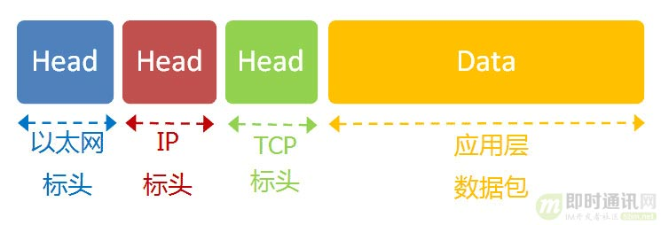

# 快速理解网络通信协议

## 五层模型

互联网的实现,分成好几层.每一层都有自己的功能,就像建筑物一样,每一层都靠下一层支持.

​	应用层 ____(Application Layer)

​		| 传输层 ____(Transport Layer)

​		| 网络层 ____(Network Layer)

​		| 链接层 ____(Link Layer)

​		| 实体层 ____(Physical Layer)

- 最底下的一层叫做实体层,最上面的一层叫做应用层,中间的三层分别是链接层,网络层,和传输层.

## 层与协议

每一层都是为了完成一种功能.为了实现这些功能,就需要大家都遵守共同的规则.大家都遵守的规则,就叫做协议("protocol").

互联网的每一层,都定义了很多协议.这些协议的总称,就叫做互联网协议(internet protocol suite).他们是互联网的核心,下面介绍每一层的功能,主要就是介绍每一层的主要协议.

## 实体层

实体层,就是把电脑连接起来的物理手段.他主要规定了网络的一些电器特性,作用是负责传送0和1的电信号.

## 链接层

### 定义

单纯的0和1没有任何意义,必须规定解读方式:多少个电信号算一组?每个信号为有何意义?

这就是链接层的功能,他在实体层的上方,确定了0和1的分组方式

### 以太网协议

早期的时候,每家公司都有自己的电信号分组方式.逐渐地,一种叫做以太网Ethenet的协议,占据了主导地位.

以太网规定,一组电信号构成一个数据包,叫做帧Frame.每一帧分成两个部分:标头Head和数据Data.

- 标头包含数据包的一些说明项,比如发送者,接受者,数据类型等等;数据则是数据包的具体内容.
- 标头的长度,固定为18字节,数据的长度,最短为46字节,最长为1500字节.因此,整个帧最短为64字节,最长为1518字节.如果数据很长,就必须分割成多个帧进行发送

### MAC地址

上面提到,以太网数据包的标头,包含了发送者和接收者的信息.那么发送者和接收者是如何标识的呢?

以太网规定,连入网络的所有设备,都必须具有网卡接口.数据包必须是从一块网卡,传送到另一块网卡.网卡的地址,就是数据包的发送地址和接收地址,这叫做MAC地址

每块网卡出厂的时候,都有一个独一无二的MAC地址,长度是48个二进制位,通常用12个十六进制数表示

- 前6位十六进制数是厂商编号,后6个是该厂商的网卡流水号.有了MAC地址,就可以定位网卡和数据包的路径了.

### 广播

1号计算机向2号计算机发送一个数据包,同一个子网络的3号,4号,5号计算机都会收到这个包.它们读取这个包的标头,找到接收方的MAC地址,然后与自身的MAC地址相比较,如果两者相同,就接收这个包,做进一步处理,负责就丢弃这个包.这种发送方式就叫广播broadcasting.

有了数据包的定义,网卡的MAC地址,广播的发送方式,连接层就可以在多台计算机之间传送数据了

## 网络层

### 网络层的由来

以太网的协议,依靠MAC地址发送数据.理论上,单单依靠MAC地址,上海的网卡就可以找到洛杉矶的网卡了,技术上是可以实现的.

但是,这样做有一个重大的缺点.以太网采用广播方式发送数据包.所有成员人手一包,不仅效率低,而且局限在发送者所在的子网络.也就是说,如果两台计算机不太同一个子网络,广播是传不过去的.这种设计是合理的,否则互联网上的每一台计算机都会收到所有包,那会引起灾难

- 互联网是无数个子网络共同组成的一个巨型网络,上海和洛杉矶的电脑会在同一个子网络,这几乎是不可能的

因此,必须找到一种方法,能够区分出那些MAC地址属于同一个子网络,那些不是.如果是同一个子网络,就采用广播方式发送,否则就采用路由方式发送.(路由的一次,就是指如何向不同的子网络分发数据包).遗憾的是,MAC地址本身无法做到这一点.它只与厂商有关,与所处网络无关.

- 这就导致了网络层的诞生.它的作用是引进一套新的地址,使得我们能够区分不同的计算机是否属于同一个子网络.这套地址就叫网络地址,

于是网络层出现以后,每台计算机就有了两个地址,一个值MAC地址,另一个是网络地址.两种地址之间没有任何联系,MAC地址是绑定在网卡上的,网络地址则是管理员分配的,他们只是随机组合在一起.

网络地址帮助我们确定计算机所在的子网络,MAC地址则将数据包送到该子网络中的目标网卡.因此,从逻辑上可以推断,必定是先处理网络地址,然后在处理MAC地址.

### IP协议

规定网络地址的协议,叫做IP协议.它所定义的地址,就被称为IP地址.目前,广泛采用的IP协议第四版,简称IPv4.

IPv4这个版本规定后,网络地址有32个二进制位组成

习惯上,我们用分成四段的十进制数表示IP地址,从0.0.0.0一直到255.255.255.255

互联网上每一台计算机,都会分配到一个ip地址.这个地址分成两个部分,前一部分代表网络,后一部分代表主机.

比如ip地址172.16.254.1,这是一个32位地址,嘉定它的网络部分是前24位172.16.254,那么主机部分就是后8位.1,处于同一个子网络的电脑,他们的ip地址的网络部分必定是相同的,也就是说172.16.254.2应该与172.16.254.1处在同一个子网络

但是,问题在于单单从ip地址,我们无法判断网络部分.还是以172.16.254.1为例,它的网络部分,到底是前24位还是前16位还是其他,从ip地址上是看不出来得.

那么,怎样才能从ip地址,判断两台计算机是否属于同一个子网络呢??这就要用到另一个参数:子网掩码subnet mask

所谓子网掩码,就是表示子网络特征的一个参数.他在形式上等同于ip地址,也是一个32位二进制数字,它的网络部分全部为1,主机部分全部为0,比如ip地址172.16.254.1,如果已知网络部分是前24位,主机部分是后8位,那么子网络掩码就是11111111.11111111.11111111.00000000,写成10进制数就是255.255.255.0

知道子网掩码,我们就能判断,任意两个ip地址是否处在同一个子网络..方法是将两个ip地址分别于其子网掩码进行与运算,然后比较结果是否相同,如果相同,就表明他们在同一个子网络中.

- ip协议的作用主要有两个,一个是为每一台计算机分配ip地址,另一个是确定哪些地址在同一个子网络

### IP数据包

根据IP协议发送的数据,就叫做IP数据包.不难想象,其中必定包括IP地址信息.但是前面说过,以太网数据包只包含MAC地址,并没有IP地址的栏位,那么是否需要修改数据定义,再添加一个栏位呢??

回答是不需要,我们可以把IP数据包直接放进以太网数据包的数据部分,因此完全不用修改以太网的规格.这就是互联网分层结构的好处:上层的变动完全不设计写成的结构

具体来说,ip数据包也分为标头和数据两个部分

head    Data

- 标头部分主要包括版本,长度,IP地址等信息,数据部分则是IP数据包的具体内容.他放进以太网数据包后,以太网数据包就变成了

  

IP数据包的标头部分的长度为20到60字节,整个数据包的总长度最大为65535字节.因此,理论上,一个ip数据包的数据部分,最长为65515字节.前面说过,以太网数据包的数据部分,最长之后1500字节.因此如果ip数据包超过了1500字节,他就需要分割成几个以太网数据包,分开发送了

### ARP协议

关于网络层,还有最后一天需要说明.因为ip数据包是放在以太网数据包里发送的,所以我们必须同时知道两个地址,一个是对方的MAc地址,另一个是对象的IP地址,通常情况下,对方的IP地址是已知的,但是我们不知道它的MAC地址

所以我们需要一种机制,能够从IP地址得到MAc地址

- 如果两台主机不在同一个子网络,那么事实上没有办法得到对方的MAC地址,只能把数据包传送到两个子网络连接处的网关gateway,让网关去处理
- 如果两台主机在同一个子网络,那么我们可以用ARP协议,得到对方的MAC地址,ARP协议也是发出一个数据包,包含在以太网的数据包中,其中包含它所要查询主机的IP地址,在对方的MAC地址这一栏,填的是FF:FF:FF:FF:FF:FF,表示这是一个广播地址,他所在的子网络的每一台主机,都会收到这个数据包,从中取出IP地址,与自身的IP地址进行比较.如果两者相同,都作出回复,向对方报告自己的MAC地址,否则就丢弃这个包.

总之,有了ARP协议之后,我们就可以得到同一个子网络内的主机MAC地址,可以把数据包发送到任意一台主机之上了.

## 传输层

### 传输层的由来

有了MAC地址和IP地址,我们已经可以在互联网上任意两台主机上建立通信.

接下来得问题是,同一台主机上有许多程序都需要用到网络,比如你一边浏览网页,一边与朋友在线聊天.当一个数据包从互联网上发来的时候,你怎么知道,它是表示网页的内容,还是表示在线聊天的内容

也就是说,我们还需要一个参数,表示这个数据包到底供哪个程序(进程)使用.这个参数就叫做端口port,他其实是每一个使用网卡的程序的编号.每个数据包都发到主机的特定端口,所以不同的程序就能渠道自己所需要的数据.

端口是0到65535之间的一个整数,正好16个二进制位.0到1023的端口被系统占用,用户只能选用大于1023的端口.不管是浏览网页还是在线聊天,应用程序会随机选用一个端口,然后与服务器的相应端口联系.

传输层的功能,就是建立端口到端口的通信.相比之下,网络层的功能是建立主机到主机的通信.主要确定主机和端口,我们就能实现程序之间的交流.因此Unix系统就把主机+端口,叫做套接字,有了它,就可以进行网络应用程序开发了.

### UDP协议

现在,我们必须在数据包中加入端口信息,这就需要新的协议.最简单的实现叫做UDP协议,它的格式几乎就是在数据前面,加上端口号.

UDP数据包也是由标头和数据两部分组成

- 标头部分主要定义了发出端口和接收端口,数据部分就是具体的内容.然后把整个UDP数据包放入IP数据包的数据部分,而前面说过,IP数据包优势放在以太网数据包之中的,所以整个以太网数据包现在变成了下面这样

  

  UDP数据包非常简单,标头部分一共只有8个字节,总长度不超过65535字节,正好放进一个IP数据包

### TCP协议

UDP协议的优点是比较简单,容易实现,但是缺点是可靠性差,一旦数据包发出,无法知道对方是否收到.为了解决这个问题,提高网络可靠性,TCP协议就诞生了.这个协议非常复杂,但可以近似认为,他就是有确定机制的UDP协议,每发出一个数据包都要求确认.如果有一个数据包遗失,就收不到确认,发出方就知道有必要重发这个数据包了.

因此,TCP协议能够确保数据不会遗失.它的缺点是过程复杂,实现困难,消耗较多的资源.

TCP数据包和UDP数据包一样,都是内嵌在IP数据包的数据部分.TCP数据包没有长度限制,理论上可以无限长,但是为了保证网络的效率,通常TCP数据包的长度不会超过IP数据包的长度,以确保单个TCP数据包不必再分割.

### 应用层

应用程序收到传输层的数据,接下来就要进行解读.由于互联网是开放架构,数据来源五花八门,必须事先规定好格式,否则根本无法解读.应用层的作用,就是规定应用程序的数据格式.

举例来说,TCP协议可以为各种各样的程序传递数据比如Email,www,DTP等,.那么必须有不同协议规定的邮件,网页,FTP数据的格式,这些应用程序协议就构成了应用层.这是最高的一层,直接面对用户.它的数据就放在TCP数据包的数据部分.

- 因此,现在的以太网数据包就变成下面这样 :

  

  