# 理解HTTP协议

## 前言

HTTP超文本传输协议,HyperText Transfer Protocol是互联网上应用最为广泛的一种网络协议.所有的www文件都必须遵守这个标准.设计http最初的目的是为了提供一种发布和接收html页面的方法

对于移动端即时通讯来说,现今主流的数据通信总结下来无外乎就是长连接+断连接的方式,而断连接在应用上讲就是http协议的应用,

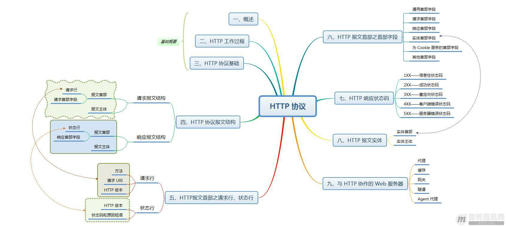

## HTTP概述

### 计算机网络体系结构分层

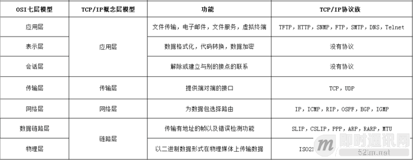

### TCP/IP通信传输流

利用TCP/IP协议族进行网络通信时,会通过分层顺序与对方进行雄心.发送端从应用层往下走,接收端则从链路层往上走.

TCP/IP通信传输流如下:

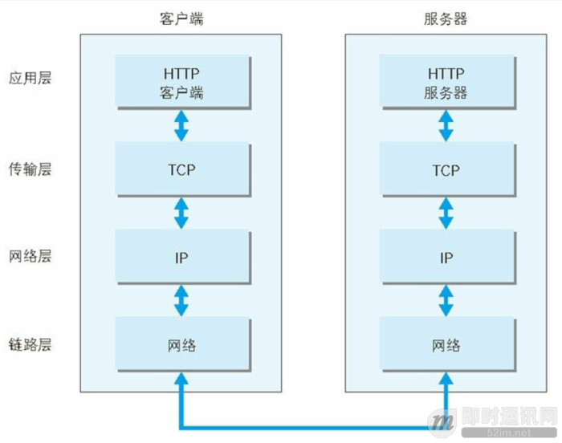

- 首先作为发送端的客户端在应用层HTTP协议发出一个想看某个web页面的http请求
- 接着,为了传输方便,在传输层tcp协议从应用层处收到的数据HTTP请求报文进行分割,并在各个报文上打上标记序号即端口号后转发给网络层
- 在网络层,ip协议,增加作为通信目的的ip地址后转发给链路层.
- 链路层增加MAC地址后,这样一来,发往网络的通信请求就准备齐全了.
- 接收端的服务器在链路层接收到数据,按序往上层发送,一直到应用层.当传输到应用层,才能算真正接收到由客户端发送过来的HTTP请求

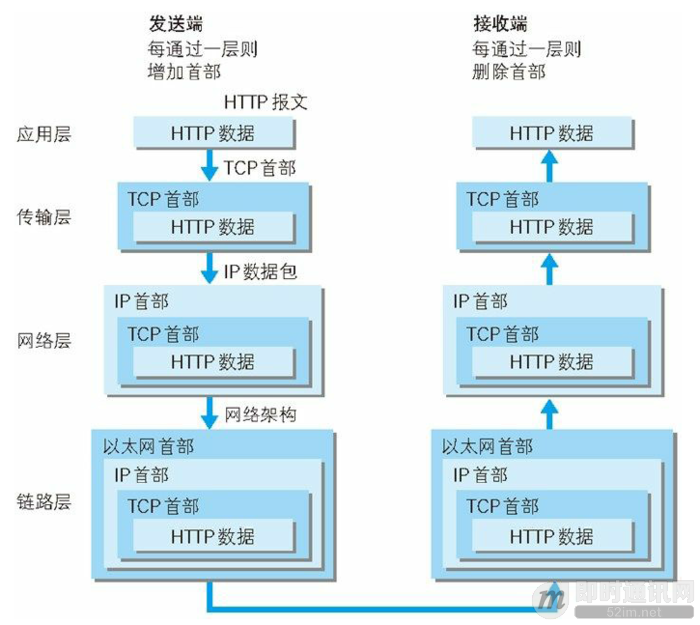

在网络体系结构中,包含了众多的网络协议,这篇文章主要围绕HTTP协议展开

> HTTP协议时用于从www服务器传输超文本到本地浏览器的传输协议.他可以使浏览器更加高效,使网络传输减少.他不仅保证计算机正确快速的传输超文本文档,还确定传输文档的那一部分,以及那部分内容首先显示等
>
> HTTP是客户端浏览器或其他程序与web服务器之间的应用层通信协议.在internet上的web服务器上存放的都是超文本信息,客户端需要通过http协议传输所要访问的超文本信息.http包含命令和传输信息,不仅可用于web访问,也可以用于其他因特网/内联网应用系统之间的通信,从而实现各类应用资源超媒体访问的集成.
>
> 我们在浏览器的地址栏输入的网站地址叫做URL统一资源定位符,就像每家每户都有一个门牌地址一样,每个网页也都有一个internet地址.当你在浏览器的地址框中输入一个URL或是单击一个超链接时,URL就确定了要浏览的地址,浏览器通过HTTP,将web服务器上站点的网页代码提取出来,并翻译成漂亮的网页.

## HTTP工作过程

HTTP通信机制是在一次完整的HTTP通信过程中,客户端和服务器之间将完成下列7个步骤:

- 1)建立TCP连接:在HTTP工作开始之前,客户端首先要通过网络与服务器建立连接,该链接是通过TCP来完成的,该协议与IP协议共同构建internet,即著名的TCP/IP协议族,因此internet又被称作是TCP/IP网络..HTTP是比TCP更高层次的应用层协议,根据规则,只有底层协议建立之后,才能进行高层协议的连接,因此,首先要建立TCP连接,一般TCP连接的端口号是80

- 2)呵护短向服务器发送请求命令:一旦建立TCP连接,客户端就会向服务器发送请求命令

  例如:GET/sample/hello.jsp HTTP/1.1;

- 3)客户端发送请求头信息:客户端发送请求命令后,还要以头信息的形式向服务器发送一些别的信息,之后客户端发送了一空白行来通知服务器,他已经结束了该头信息的发送

- 4)服务器应答:客户端向服务器发出请求后,服务器会给客户端返回响应

  例如:HTTP/1.1 200 OK

  响应的第一部分是协议的版本号和响应状态码

- 5)服务器返回响应头信息:正如客户端会随同请求发送关于自身的信息一样,服务器也会随同响应向用户发送关于他自己的数据被请求的文档

- 6)服务器向客户端发送数据:服务器向客户端发送头信息后,他会发送一个空白行来表示头信息的发送到此结束,接着他就以Content-Type响应头信息所描述的格式发送用户所请求的实际数据

- 7)服务器关闭TCP连接:一般情况下,一旦服务器向客户端返回了请求数据,他就要关闭TCP连接,然后如果客户端或者服务器在其头信息加入了这行代码Connection:keep-alice,TCP连接在发送后将仍然保持打开状态,于是,客户端可以继续通过相同的连接发送请求.保持连接节省了为每个请求建立新连接所需的时间,还节约了网络带宽.

## HTTP协议基础

### 通过请求和响应的交换达成通信

应用HTTP协议时,必定是一端担任客户端角色,另一端担任服务器端角色.仅从一条通信线路来说,服务器端和客户端的角色是确定的.HTTP协议规定,请求从客户端发出,最后服务器端响应该请求并返回.换句话说,肯定是先从客户端开始建立通信的,服务器端在没有接收到请求之前不会发送响应.

### HTTP是不保存状态的协议

HTTP是一种无状态协议.协议自身不对请求和响应之间的通信状态进行保存.也就是说在HTTP这个级别,协议对于发送过的请求或响应都不做持久化处理.这是为了更快的处理大量事务,确保协议的可伸缩性,而特意把HTTP协议涉及成如此简单的.

可是随着web的不断发展,我们的很多业务都需要对通信状态进行保存.于是我们一如了cookie技术.有了cookie在用http协议通信,就可以管理状态了.

### 使用Cookie的状态管理

Cookie技术通过在请求和响应报文中写入Cookie信息来控制客户端的状态.Cookie会根据从服务器端发送的响应报文内的一个叫做Set-Cookie的首部字段信息,通过客户端保存Cookie.当下次客户端再往该服务器发送请求时,客户端会自动在请求报文中加入Cookie值后发送出去.服务器端发现客户端发送过来的Cookie后,会去检查究竟是从哪一个客户端发来的连接请求,然后对比服务器上的记录,最后得到之前的状态信息.

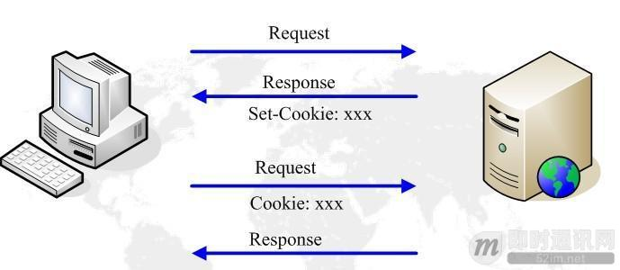

### 请求URI定位资源

HTTP协议使用URI定位互联网上的资源.正是因为URI的特定功能,在互联网上任意位置的资源都能访问到.

### 告知服务器意图的HTTP方法

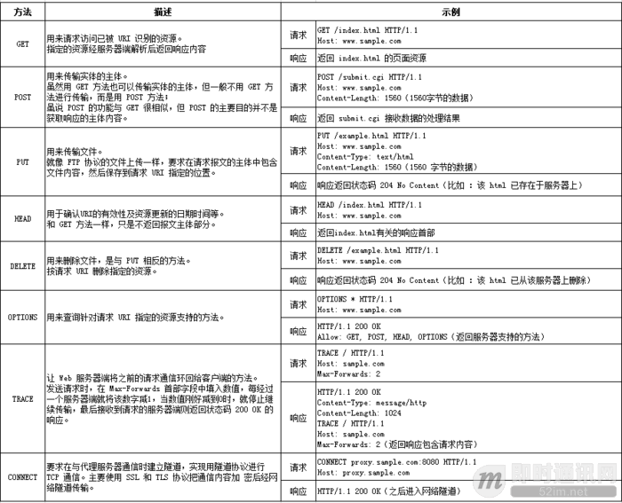

### 持久连接

HTTP协议的初始版本中,每进行一个HTTP通信都要断开一次TCP连接.比如使用浏览器浏览一个包含多张图片的HTML页面时,在发送请求访问HTML页面资源的同时,也会请求该HTML页面里包含的其他资源.因此每次的请求都会造成无谓的TCP连接建立和断开,增加通信量的开销.

为了解决上述TCP的连接问题,HTTP/1.1和部分hTTP/1.0相处了持久连接的方法.其特点是只要任意一段没有明确提出断开连接,则保持TCP连接状态.旨在建立一次TCP连接后进行多次请求和响应的交互,在HTTP/1.1中,所有的连接默认是持久连接.

### 管线化

持久连接使得多请求以管线化方式发送成为可能.以前发送请求后需等待并接受到响应,才能发送下一个请求.管线化技术出现后,不用等待亦可发送下一个请求.这样就能做到同时并行发送多个请求,而不需要一个接一个地等待响应了.

比如,当请求一个包含多张图片的HTML页面时,与挨个连接相比,用持久连接可以让请求更快结束.而管线化技术要比持久连接速度更快,请求数越多,时间差就越明显.

## HTTP协议报文结构

### HTTP报文

用于HTTP协议交互的信息被称为HTTP报文.请求段的HTTP报文叫做请求报文;响应段的叫做响应报文.HTTP报文本身是由多行数据构成的字符串文本.

###HTTP报文结构

HTTP报文大致可分为报文首部和报文主体两部分.两者由最初出现的空行来划分.通常,并不一定有报文主体.

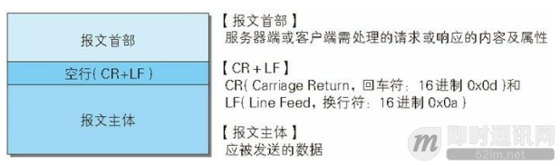

### 请求报文结构

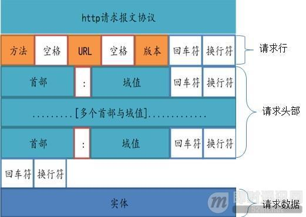

请求报文的首部内容由以下数据组成:

- 请求行--包含用于请求的方法,请求URI和HTTP版本
- 首部字段--包含表示请求的各种条件和属性的各类首部(通用首部,请求首部,实体首部以及RFC里未定义的首部如Cookie等)

请求报文的示例:

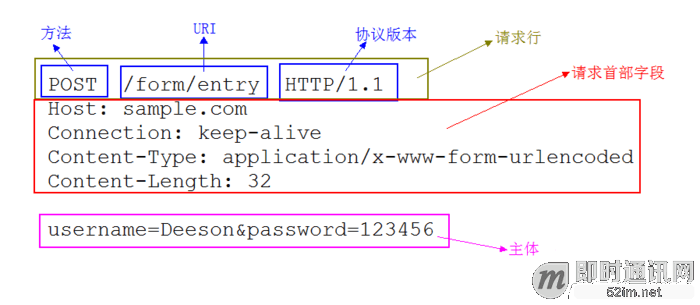

### 响应报文结构

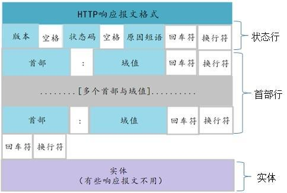

响应报文的首部内容是由以下数据组成:

- 状态航---包含表明响应结果的状态码.原因短语和HTTP版本
- 首部字段---与请求基本一致

响应报文的示例,如下:

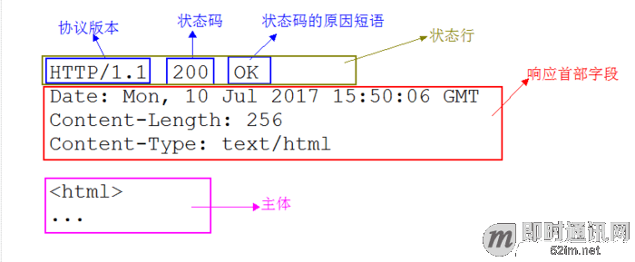

