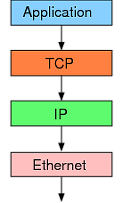
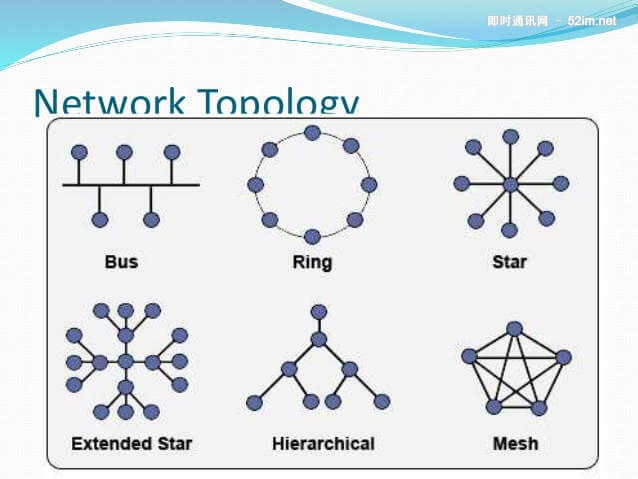
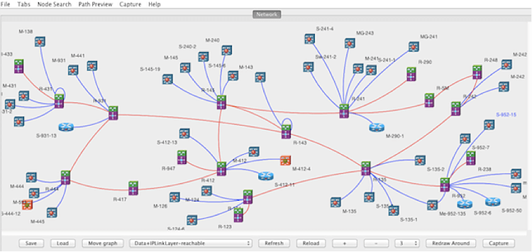
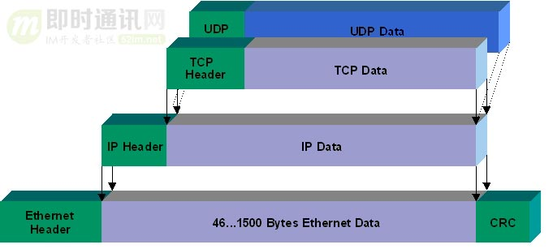
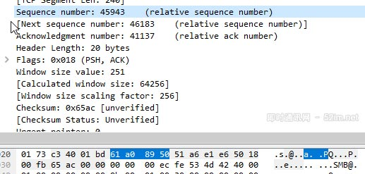
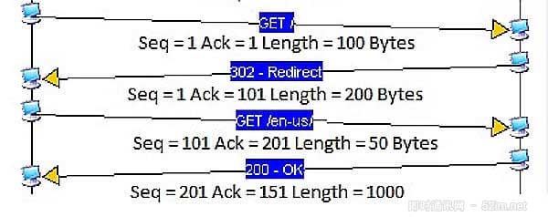

# 快速理解TCP协议

## TCP协议的作用

互联网有一整套协议构成.TCP只是其中的一层,有着自己的分工

- TCP是以太网协议和IP协议的上层协议,也是应用层协议的下层协议

最底层的以太网协议Ethernet规定了电子信号如何组成数据包packet,解决了子网内部的点对点通信.

- 以太网协议解决了局域网的点对点通信

但是以太网协议不能解决多个局域网如何互通,这由IP协议解决

- ip协议可以连接多个局域网

IP协议定义了一套自己的地址规则,成为IP地址.它实现了路由功能,允许某个局域网的A主机,向另一个局域网的B主机发送消息.

- 路由器就是基于IP协议,局域网之间要靠路由器连接

路由的原理很简单.市场上所有的路由器,背后都有很多网口,要接入多根网线.路由器内部有一张路由表,规定了A段IP地址走出口1,B段IP地址走出口2......通过这套之路牌,实现了数据包的转发.

IP协议只是一个地址协议,并不保证数据包的完整.如果路由器丢包,就需要发现丢了哪一个包,以及如何重新发送这个包,这就要依靠TCP协议

简单说,tcp协议的作用是,保证数据通信的完整性和可靠性,防止丢包

## TCP数据包的大小

以太网数据包的大小是固定的,最初是1518字节,后来增加到1522字节.其中1500字节是负载payload,22字节是头信息head.ip数据包在以太网数据包的负载里面,他也有自己的头信息,最少需要20字节,所以ip数据包的负载最多为1480字节

- ip数据包在以太网数据包里面,tcp数据包在ip数据包里面

TCP数据包在IP数据包的负载里面.它的头信息最少也需要20字节,因此TCP数据包的最大负载是1480-20=1460字节.由于IP和TCP协议往往有额外的头信息,所以TCP负载实际为1400字节左右..因此,一条1500字节的信息需要两个TCP数据包.HTTP/2协议的一大改进,就是压缩HTTP协议的头信息,使得一个HTTP请求可以放在一个TCP数据包里面,而不是分成多个,这样就提高了速度.

- 以太网数据包的负载是1500字节,TCP数据包的负载在1400字节所有

## TCP数据包的编号SEQ

一个包1400字节,那么一次性发送大量数据,就必须分成多个包.比如,一个10M的文件,就需要发送7100多个包.发送的时候,TCP协议为每个包编号(sequence number,简称SEQ),以便接收的一方按照顺序还原.万一发生丢包,也可以知道丢失的是哪一个包.

第一个包的编号是一个随机数.为了便于理解,这里就把他称为1号包.假定这个包的负载长度是100字节,那么可以推算出下一个包的编号应该是101.这就是说,每个数据包都可以得到两个编号,自身的编号以及下一个包的编号.接收方由此知道,应该按照什么顺序来将他们还原成原始文件.

- 当前包的编号为45943,下一个数据包的编号为46183,由此可知,这个包的负载是240字节

## TCP数据包的封装

收到TCp数据包以后,组装还原是操作系统完成的.应用程序不会直接处理TCP数据包.对于应用程序来说,不用关心数据通信的细节.除非线路异常,收到的总是完整的数据.应用程序需要的数据放在TCp数据包里面,有自己的格式.

TCP并没有提供任何机制,来表示原始文件的大小,这有应用层的协议来规定,比如,http协议就有一个头信息Content-Length,表示信息体的大小.对于操作系统来说,就是持续地接收TCP数据包,将他们按照顺序组装好,一个包都不少.

操作系统不会去处理TCP数据包里面的数据.一旦组装好TCp数据包,就把他们转交给应用程序.TCP数据包里面有一个端口参数,就是用来指定转交给监听该端口的应用程序

系统根据TCP数据包里面的端口,将组装好的数据转交给相应的应用程序

应用程序收到组装好的原始数据,以浏览器为例,就会根据HTTP协议的Content-Length字段正确读出一段段的数据.这也意味着,一次TCP通信可以包括多个HTTP通信.

## 慢启动和Ack

服务器发送数据包,当然越快越好,最好一次性全发出去.但是发的太快,就有可能丢包.带宽小,路由器过热,缓存移除等许多因素都会导致丢包.路线不好的话,发的越快,丢的越多.

最理想的状态,在线路允许的情况下,达到最高速率.但是我们怎么知道,对方线路的理想速率是多少呢?答案就是慢慢试...

TCP协议为了做到效率与可靠性的统一,设计了一个慢启动slow start机制.开始的时候,发送的较慢,然后根据丢包的情况,调整速率:如果不丢包,就加快发送速度;如果丢包,就降低发送速度

Linux内核里面设定了常量TCP_INIT_CWND,刚开始通信的时候,发送方一次性发送10个数据包,即发送窗口的大小为10.然后停下来,等待接收方的确认,再继续发送.默认情况下,接收方每收到两个TCp数据包,就要发送一个确认消息.确认的英语是acknowledgement,所以这个确认消息就简称ACK.

ACK携带两个信息:

- 期待要收到下一个数据包的编号
- 接收方的接收窗口的剩余容量

发送方有了这两个信息,再加上自己已经发出的数据包的最新编号,就会推测出接收方大概的接收速度,从而降低或增加发送速率.这被称为发送窗口,这个窗口的大小是可变的.

每个ack都带有下一个数据包的编号,以及接收窗口的剩余容量,双方都会发送ack

注意:由于TCP通信是双向的,所以双方都需要发送ACK.两方的窗口大小,很可能是不一样的.而且ack只是很简单的几个字段,通常与数据合并在一个数据包里面发送.

上图一共4次通信.第一次通信,A主机发给B主机的数据包编号是1,长度是100字节,因此第二次通信B主机的ACK编号是101,第三次通信A主机的数据包编号也是101,第二次通信B主机发给A主机的编号是1,长度是200字节,因此第三地A主机的ACK是201,第四次通信B主机的数据包编号是201

即时对于带宽很大,线路很好的连接,TCP也总是从10个数据包开始慢慢试,过了一段时间以后,才达到最高的传输速率.这就是TCP的慢启动

## 数据包的遗失处理

TCP协议可以保证数据通信的完整性,这是怎么做到的???

前面说过,每一个数据包都带有下一个数据包的编号.如果下一个数据包没有收到,那么ack的编号就不会发生变化.

举例来说,现在收到了4号包,但是没有收到5号包,ACK就会记录,期待收到5号包.过了一段时间,5号包收到了,那么下一轮ACK会更新编号.

如果5号包还是没收到,但是收到了6号包,那么ACK里面的编号不会变化,总是显示5号包.这回导致大量重复内容的ACK.

如果发送方发现收到三个连续的重复ACK,或者超时了还没有收到任何ACK,就会确认丢包,即5号包遗失了,从而再次发送这个包,通过这种机制,TCP保证了不会有数据包丢失

