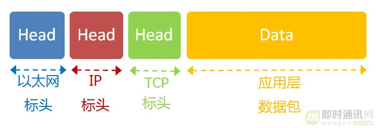

# 快速理解网络通信协议

我们已经知道,网络通信就是交换数据包.电脑A向电脑B发送一个数据包,后者收到了,回复一个数据包,从而实现两台电脑之间的通信.



发送这个包,需要知道两个地址

- 对方的MAC地址
- 对方的IP地址

有了这两个地址,数据包才能准确送到接受者手中.但是,前面说过,MAC地址有局限性,如果两台电脑不在同一个子网络,就无法知道对方的MAC地址,必须通过网关gateway转发


上图中,1号电脑要向4号电脑发送一个数据包.它先判断4号电脑是否在同一个子网络,结果发现不是,于是就把这个数据包发到网关A.网关A通过路由协议,发现4号电脑位于子网络B,又把数据包发给网关B,网关B在转发到4号电脑.

1号电脑吧数据包发到网关A,必须知道网关A的MAC地址,所以数据包的目标地址,实际上分成两种情况

| 场景           | 数据包地址                 |
| -------------- | -------------------------- |
| 同一个子网络   | 对方的MAC地址,对方的IP地址 |
| 非同一个子网络 | 网关的MAC地址,对方的IP地址 |

发送数据包之前,电脑必须判断对方是否在同一个子网络,然后选择相应的MAC地址.接下来,我们就来看,实际使用中,这个过程是怎么完成的.

## 用户的上网设置

### 静态IP地址

通常,一台新电脑插上网线,必须做一些设置.把下面四个参数填入操作系统,计算机就能连上网了:

- 本机的IP地址
- 子网掩码
- 网关的IP地址
- DNS的IP地址

这四个参数缺一不可.由于他们是给定的,计算机每次开机,都会分到同样的ip地址,所以这种情况被称作静态ip地址上网.但是这样的设置很专业,普通用户望而生畏,而且如果一台电脑的ip地址保持不变,其他电脑就不能使用这个地址,不够灵活.出于这两个原因,大多数用户使用动态ip地址上网

### 动态IP地址

所谓动态IP地址,指计算机开机后,会自动分配到一个ip地址,不用认为设定.它使用的协议叫做DHCP协议.

这个协议规定,每一个子网络中,有一台计算机负责管理本网络的所有IP地址,他叫做DHCP服务器.新的计算机加入网络,必须向DHCP服务器发送一个DHCP请求数据包,申请IP地址和相关的网络参数

前面说过,如果两台计算机在同一个子网络,必须知道对方的MAC地址和IP地址,才能发送数据包.但是,新加入的计算机不知道这两个地址,怎么发送数据包呢?DHCP协议做了一些巧妙的规定.

### DHCP协议

首先,它是一种应用层协议,建立在UDP协议之上,

- 最前面的以太网标头:设置发出方(本机)的MAC地址和接收方(DHCP服务器)的MAC地址.前者就是本机的MAC,后者不知道,就填一个广播FF:FF:FF:FF:FF:FF
- 后面ip标头:设置发出方的IP地址和接收方的IP地址.这时由于两个本机都不知道,发出方填0.0.0.0.接收方设置为255.255.255.255
- 最后的UDP标头:设置发出方和接收方的端口,这部分是DHCP协议规定好的,发出方是68端口,接收方是67端口

这个数据包构造完成后,就可以发出了.以太网是广播发送,同一个子网络每台计算机都收到了这个包.因为接收方MAC地址是FF:FF:FF:FF:FF:FF,看不出是发给谁的,所以每台收到这个包的计算机,还需分析这个包的ip地址,才能确定是不是发给自己的,当看到发出方ip0.0.0.0,接收方ip255.255.255.255时,于是DHCP服务器就知道这个包是发给我的,而其他计算机则丢弃这个包

接下来,DHCP服务器读取这个包的数据内容,分配好IP地址,发送回去一个DHCP响应数据包.这个响应的包结构也是类似的,以太网标头的MAC地址是双方网卡的地址,IP标头的IP地址是DHCP服务器的IP地址(发出方),接收方时255.255.255.255,UDP端口是67,68,分配给请求端的ip地址和本网络的具体参数在data里面

新加入的计算机收到了这个响应包,于是就知道了自己的IP地址,子网掩码,网关地址,DNS服务器等参数

## 上网设置:小结

- 确定四个参数
  - 本机IP地址
  - 子网掩码
  - 网关的IP地址
  - DNS的IP地址

## 访问网页实例

### 本机参数

我们假定,用户设置好了自己的网络参数

- 本机ip地址:192.168.1.100
- 子网掩码:255.255.255.0
- 网关ip地址:192168.1.1
- DNS的ip地址:8.8.8.8

### DNS协议

发送数据包,必须要知道对方的ip地址.但是现在我们只知道网址www.baidu.com,不知道它的IP地址.DNS协议可以帮助我们,将这个网址转换成IP地址.已知DNS服务器为8.8.8.8,于是我们向这个地址发送一个DNS数据包(53端口)


然后DNS服务器做出响应,告诉我们baidu的IP地址是xx.xx.xx.xx,于是我们知道了对方的IP地址

### 子网掩码

接下来我们要判断,这个IP地址是不是在同一个子网络,这就要用到子网掩码

本机与baidu不在同一个子网络,因此我们要向baidu发送一个数据包,必须通过网关192.168.1.1转发,也就是说,接收方的MAC地址将是网关的MAC地址

### 应用层协议

浏览网页用的是HTTP协议,它的整个数据包构造是


HTTP部分的内容,类似下面

```text
GET / HTTP/1.1
Host:[url=http://www.baidu.com]www.baidu.com[/url]
Connection:keep-alive
User-Agent:Mozilla/5.0(Windows NT 6.1) ......
Accept:text/html,application/xhtml+xml,application/xml;q=0.9,*/*;q=0.8
Accept-Encoding: gzip,deflate,sdch
Accept-Language: zh-CN,zh;q=0.8
Accept-Charset: GBK,utf-8;q=0.7,*;q=0.3
Cookie: ... ...
```

假定这部分长度为4510字节,他会被嵌在tcp数据包中

### TCP协议

tcp数据包需要设置端口,接收方baidu的http端口默认是80,发送方本机的端口是一个随机生成的1024-65535之间的整数,假定我8880,tcp数据包的标头长度为20字节,加上嵌入http的数据包,总长度变为4530字节

### IP协议

tcp数据包在嵌入IP数据包.IP数据包需要设置双方的IP地址,这是已知的,发送方是本机,接收方是dns获取到的ip.

ip数据包的标头长度为20字节,加上嵌入的TCP数据包,总长度4550字节

### 以太网协议

最后IP数据包嵌入以太网数据包.以太网数据包需要设置双方的MAc地址,发送方为本机的MAC地址,接收方为网关192.168.1.1的MAC地址(通过ARP协议得到)

以太网数据包的数据部分,最大长度为1500字节,而现在的ip数据包长度为4550字节,因此iP数据包必须分割成4个包,因为每个包都有自己的IP标头,所以4个包的ip数据包的长度分别为1500,1500,1500,110


### 服务器端的响应

经过多个网关的转发,baidu的服务器xx.xx.xx.xx收到了这4个以太网数据包,根据ip标头的序号,baidu将四个包拼起来,取出完整的TCP数据包,然后独处里面的HTTP请求,接着做出HTTP响应,在用TCP协议发出来.

本机收到响应之后,就可以将网页显示出来。。