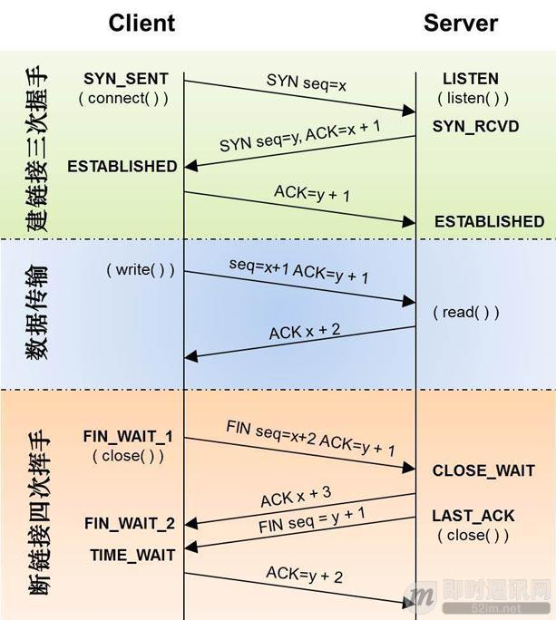

# 快速理解TCP和UDP的差异

## 建立连接方式的差异

### TCP

说到Tcp建立连接,相信大多数人脑海里肯定可以浮现出一个词,没错就是'三次握手'.TCP通过'三次握手'来建立连接,再通过'四次挥手'断开一个连接.在每次挥手中TCP做了哪些操作呢?

上图就从客户端和服务端的角度,清楚的展示了TCP的三次握手和四次挥手.可以看到,当TCP试图建立连接时,三次握手指的是客户端主动触发了两次,服务端触发了一次.

我们可以先明确一些TCP建立连接并且初始化的目标是什么呢?

- 初始化资源
- 告诉对方我的序列号

所以三次握手的次序是这样的

- client端首先发送一个SYN包告诉server端我的初始序列号是X
- server端收到SYN包后回复给client一个ACK确认包,告诉client说我收到了
- 接着server端也需要告诉client端子机的初始序列号,于是server也发送了一个SYN包告诉client我的初始序列号是Y
- client收到后,回复server一个ACK确认包说我知道了.

其中2.3步骤可以简化为一步,也就是说将ack确认包和syn序列化包一同发送给client端.到此我们就比较简单的解释了TCP建立连接的三次握手

### UDP

我们都知道TCp是面向连接的,可靠的,有序的传输层协议,而UDp是面向数据报的.不可靠的,无需的传输协议,所以UDP压根不会建立什么连接

就好比发短信一样,UDP只需要知道对方的ip地址,将数据报一份一份的发送过就可以了,其他的作为发送方,都不关心.

## 数据发送方式的差异

关于TCP,UDP之间数据发送的差异,可以体现二者最大的不同之处:

- TCP:

  由于TCP是建立在两端连接之上的协议,所以理论上发送的数据流不存在大小的限制.但是由于缓冲区有大小限制,所以你如果用TCP发送一段很大的数据,可能会截断成好几段,接收方依次的接收

- UDP:

  由于UDP本身发送的就是一份一份的数据报,所以自然而然的就有一个上限的大小.

那么每次UDP发送的数据报大小由那些因素共同决定呢?

- UDP协议本身,UDP协议中有16位的UDP报文长度,那么UDP报文长度不能超过65535
- 以太网Ethernet数据帧的长度,根据链路层的MTU(最大传输单元)
- socket的UDP发送缓存区大小

## 数据有序性的差异

### TCP

对于TCp来说,本身TCP有着超时重传,错误重传,还有等等一系列复杂的算法保证了TCp的数据是有序的,假设你发送了数据1,2,3,则只要发送端和接收端保持连接时,接收端收到的数据始终都是1,2,3

### UDP

而UDP协议则要奔放的多,无论server端无论缓冲池大小有多大,接收端client发来的消息总是一个一个的接收.并且由于UDP本身的不可靠性以及无序性,如果client发送了123这三个数据报过来,server端接收到的可能是任意顺序的组合

## 可靠性的差异

### TCP

TCP内部的很多算法机制让他保持连接的过程中是很可靠的.比如TCP的超时重传,错误重传,TCP的流量控制,阻塞控制,慢启动算法,拥塞避免算法,快速恢复算法等等,所以TCP是一个内部原理复杂,但是使用起来比较简单的这么一个协议

### UDP

UDP是一个面向非连接的协议,UDP发送的每个数据报带有自己的IP地址和接收方的IP地址,它本身对这个数据报是否出错,是否达到不关心,只要发出去了就好了

所以来研究下,什么情况下会导致UDP丢包

- 数据报分片重组丢失:UDP每个数据报大小多少合适,事实上UDP协议本身规定的是64k,但是在数据链路层有MTU限制,大小大概在5k,所以当你发送一个很大的UDP包的时候,这个包会在IP层进行分片,然后重组.这个过程就有可能导致分片的丢包,UDP本身有CRC检测机制,会抛弃掉丢失的UDP包
- UDP缓冲区填满:当UDP的缓冲区已经被填满的时候,接收方还没有处理这部分的UDP数据报,这个时候再过来的数据包就没有地方可以存了,自然就被丢弃了.

### 使用场景总结

UDP:UDP与TCP相比,在性能速度上是占优势的.因为UDP并不用保持一个持续的连接,也不需要对收发包进行确认.但事实上,经过这么多年的发展,TCP已经拥有足够多的算法和优化,在网络状态不错的情况下,TCP的整体性能是由于UDP的

那在什么时候我们费用UDP不可呢???

- 对实时性要求高:比如实时会议,实时视频这种情况下,如果使用TCP,当网络不好发生重传时,画面肯定会有延时,甚至越堆越多.如果使用UDP的话,即时偶尔丢了几个包,但是也不会影响什么,这种情况下使用UDP比较好.
- 多点通信:TCP需要保持一个长连接,那么在涉及多点通讯的时候,肯定需要和多个通信节点建立起双向连接,然后有时在NAT环境下,两个通信节点建立起直接的TCP连接不是一个容易的事情,而UDp可以无需保持连接,直接发就可以了,所以成本会很低,而且穿透性好.这种情况下使用UDP也是没错的.

在此之外的情况下,用TCP.

when it doubt,use TCP.