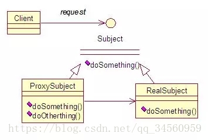

https://blog.csdn.net/qq_34560959/article/details/80981890

# 设计模式之代理模式

## 代理模式的定义

什么是代理模式

- 为其他对象提供代理对象,以控制对这个对象的访问
- 为其他对象提供代理以控制对这个对象的访问,代理对象起到了中介作用,不涉及功能服务,亦可以增加额外的服务

### 代理模式的分类

### 代理模式的实现

android中常用__智能引用代理.

静态代理:代理和被代理对象在代理前都是被确定的,他们都实现相同的接口或继承相同的抽象类



ProxySubject和RealSubject都继承Subject,Client请求Subject的doSomething方法,本应该调用RealSubject中的doSomething方法,但我们实际看到确实调用ProxySubject中的doSomething,在ProxySubject方法中doSomething方法再去调用RealSubject中的doSomething方法,我们实际看到的是ProxySubject方法中的doSomething方法,这样就完成代理

- 定义接口

  ```java
  public interface Subject{
      public void doSomething();
  }
  ```

- 被代理的对象

  ```java
  public void RealSubject implements Subject{
      public void doSomething(){
          sout("real");
      }
  }
  ```

- 代理对象

  ```java
  public class Proxy implements Subject{
      private Subject mTarget;
      
      public Proxy(){
          mTarget = new RealSubject();
      }
      
      public void doSomething(){
          sout("start");
          subject.doSomething();
          sout("end");
      }
      
  }
  ```

- 调用

  ```java
  public class Test{
      public static void main(String[] args){
          Proxy proxy = new Proxy();
          proxy.doSomething();
      }
  }
  ```

### 静态代理的聚合

- 创建多个代理

  ```java
  public class TimeProxy implements ISubject{
      private static final String TAG = "TimeProxy";
      private ISubject iSubject;
      
      public TimeProxy(ISubject subject){
          isubject = subject;
      }
      
      public void doSomething(){
          sout("Time start");
          iSubject.doSomething();
          sout("Time end");
      }
  }
  ```

  ```java
  public class LogProxy implements ISubject{
      private static final String TAG = "LogProxy";
      private ISubject iSubject;
      
      public LogProxy(Isubjcet subject){
          iSubject = subject;
      }
      
      public void doSomething(){
          sout("Log start");
          iSubject.doSomething();
          sout("log end");
      }
  }
  ```

- 调用

  ```java
  public class Test{
      public static void main(String[] args){
          ISubject subject = new RealSubject();
          TimeProxy time = new TimeProxy(subject);
          LogProxy log = new LogProxy(time);
          
          log.doSomething();
      }
  }
  ```

这里的实现可以按自由的顺序添加不同的代理.

但是,每个代理类需要实现接口中所有的方法.太过于麻烦,这里就出现了动态代理

## 动态代理

InvocationHandler

```java
public class DynamicProxy implements InvocationHandler{
    /**
     *	@param proxy代理类
     *  @param method被代理的方法
     *  @param args 被代理方法的参数
     *  @return 返回代理对象
     *  
     */
    public Object invoke(Object proxy,Method method,Object[] args){
        return null;
    }
}
```

InvocationHandler是一个接口,只有一个抽象方法,invoke

其次就是Proxy动态代理类,Proxy.newProxyInstance(ClassLoader,loader,class)

```java
public class RealSubject implements Subject{
    public void doSomething(){
        sout("realSubject");
    }
}
```

创建事务处理类

```java
public class DynamicProxy implements InvocationHandler{
    private Object mTarget;
    public DynamicProxy(Object target){
        mTarget = target;
    }
    public Object invoke(Object proxy,Method method,Object[] args){
        sout("start");
        method.invoke(target);
        sout("end");
        return null;
    }
}
```

```java
public class Test{
 	RealSubject subject = new RealSubject();
    DynamicProxy proxy = new DynamicProxy(subject);
    ClassLoader loader=  subject.getClass().getClassLoader();
    ISubject proxyObj = (ISubject)Proxy.newProxyInstance(loader,subject.getClass().getInterfaces(),proxy);
    proxyObj.doSomething();
}
```

## 总结

优点

- 代理模式能够协调调用者和被调用者,在一定程度上降低了系统的耦合度
- 代理对象可以在客户端和目标对象之间起到中介的作用,这样起到了保护目标对象的作用

缺点:

- 由于在客户端和真是对象直接增加了代理对象,因此有些类型的代理模式可能会造成请求的处理速度变慢
- 实现代理模式需要额外的工作,有些代理模式的实现非常复杂

